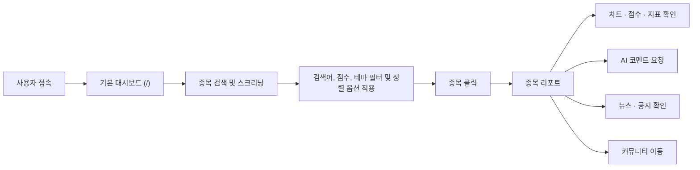
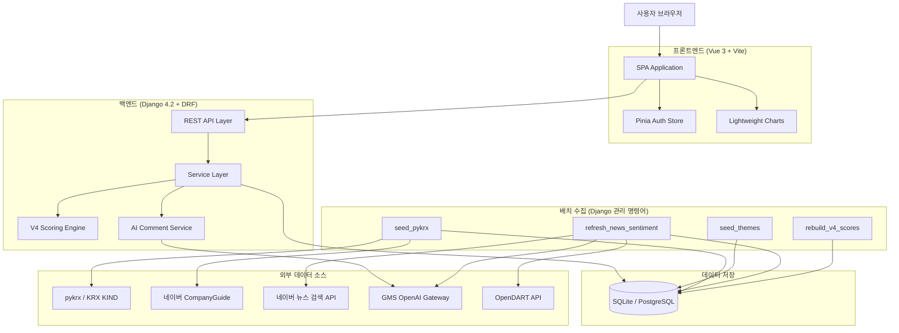
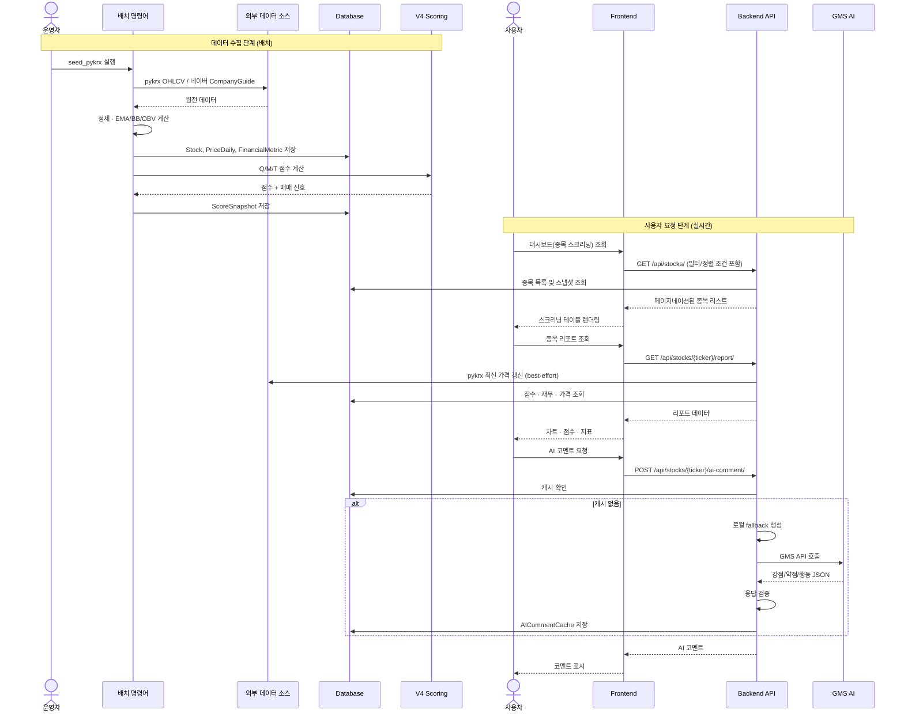
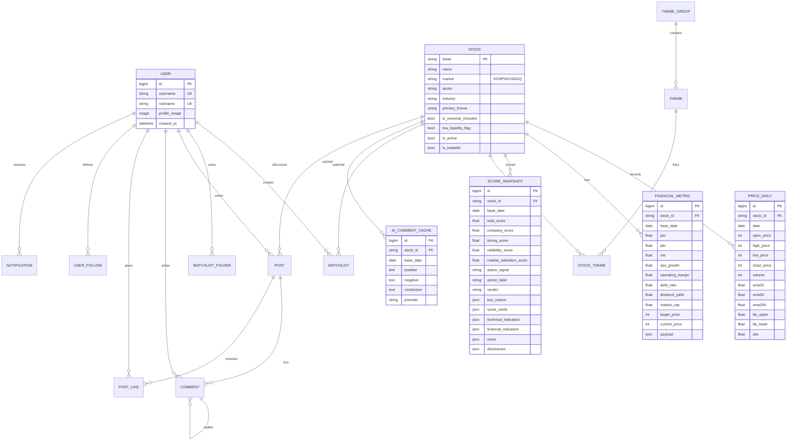
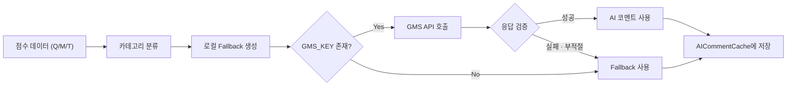
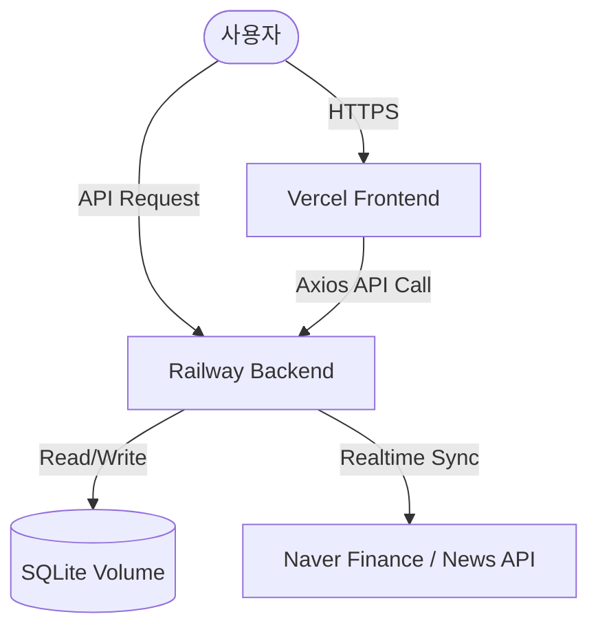

# AlphaPick

> 국내 주식 종목을 정량적으로 평가하고, 회사 품질·시장 검증·매수 타이밍 세 축의 점수를 기반으로 종목을 검색 및 스크리닝하는 정량 분석 서비스

[서비스 바로가기](https://alphapick.vercel.app/) |  [API 문서](docs/API.md)

**프로젝트 기간:** 2026.05.20 ~ 2026.06.25  
**팀:** ssafy-13-pjt 3반 7조  
**저장소:** [github.com/ssafy-1-pjt/Alphapick](https://github.com/ssafy-1-pjt/Alphapick)  
**개발 상태:** 배포 완료

| 구분 | 기술 |
|------|------|
| Frontend |    |
| Backend |    |
| Data |   |
| AI |  |

---


## 목차

1. [프로젝트 개요](#1-프로젝트-개요)
2. [목표 서비스 및 실제 구현 정도](#2-목표-서비스-및-실제-구현-정도)
3. [주요 기능](#3-주요-기능)
4. [사용자 이용 흐름](#4-사용자-이용-흐름)
5. [기술 스택](#5-기술-스택)
6. [시스템 아키텍처](#6-시스템-아키텍처)
7. [데이터 흐름](#7-데이터-흐름)
8. [데이터베이스 모델링](#8-데이터베이스-모델링)
9. [추천 알고리즘 및 핵심 로직](#9-추천-알고리즘-및-핵심-로직)
10. [생성형 AI 활용](#10-생성형-ai-활용)
11. [API 명세](#11-api-명세)
12. [디렉터리 구조](#12-디렉터리-구조)
13. [팀원 정보 및 업무 분담](#13-팀원-정보-및-업무-분담)
14. [개발 과정과 기술적 의사결정](#14-개발-과정과-기술적-의사결정)
15. [실행 방법](#15-실행-방법)
16. [테스트](#16-테스트)
17. [배포 구조](#17-배포-구조)
18. [외부 API 및 데이터 출처](#18-외부-api-및-데이터-출처)
19. [보안 및 개인정보 처리](#19-보안-및-개인정보-처리)
20. [성능 및 최적화](#20-성능-및-최적화)
21. [트러블슈팅](#21-트러블슈팅)
22. [프로젝트 성과와 회고](#22-프로젝트-성과와-회고)
23. [향후 개선 계획](#23-향후-개선-계획)
24. [참고 자료 및 라이선스](#24-참고-자료-및-라이선스)

---

## 1. 프로젝트 개요

### 1.1 프로젝트 소개

AlphaPick은 국내 주식 종목을 **회사 품질(Q)**, **시장 검증(M)**, **매수 타이밍(T)** 세 축으로 분리 평가하여, 종합 점수와 정량 분석 데이터 기반으로 종목을 스크리닝하고 분석 리포트를 제공하는 서비스입니다.

사용자는 단순히 정성적 "추천 종목"을 받는 것이 아니라, 각 종목의 세부 평가 영역이 **왜 해당 점수를 받았는지** 점수·지표·매매 신호 근거를 명확하게 확인할 수 있습니다. 종목 리포트에서는 가격 차트, 기술/재무 지표, 뉴스·공시, 생성형 AI 코멘트를 종합적으로 제공합니다.

### 1.2 개발 배경

| 기존 문제 | AlphaPick의 접근 |
|-----------|-----------------|
| 종목 추천 서비스가 근거를 충분히 설명하지 않음 | 점수 카드, 핵심 사유, 매매 신호 워터폴을 투명하게 공개 |
| 회사 가치와 매수 타이밍을 혼동하기 쉬움 | Q / M / T 세 축을 독립 계산 후 가중 기하평균으로 합산 |
| 복잡한 수치와 지표의 해석 장벽 | Q/M/T 세부 점수화 및 생성형 AI의 직관적 해석 코멘트 제공 |
| 감정이나 소문에 휩쓸리기 쉬운 투자 | 객관적인 정량 데이터 및 규칙 기반 스크리닝 환경 구축 |

### 1.3 핵심 가치

1. **투명한 근거 제공** — 종합 점수뿐 아니라 Q/M/T 세부 점수, 매매 신호 워터폴, 경고 사유를 종목 리포트에서 공개합니다.
2. **다차원 정량 스크리닝** — 회사 품질(Q), 시장 검증(M), 매수 타이밍(T) 세 축을 독립 정렬 및 필터링할 수 있어 사용자 취향에 부합하는 종목을 탐색할 수 있습니다.
3. **정량 알고리즘과 생성형 AI 분리** — 점수와 판단은 규칙 기반 알고리즘이 결정하고, 생성형 AI는 결과를 자연어로 설명하는 역할만 합니다.
4. **데이터 기반 위험 관리** — Z-Score 과열 할인, EMA 하향 이탈 감지 등 다층 위험 보정을 적용합니다.
5. **배치 수집 → DB 저장 → API 제공** — 프론트엔드가 외부 API를 직접 호출하지 않아 외부 장애가 화면 전체 장애로 확산되지 않습니다.

### 1.4 주요 사용자

| 사용자 | 주요 요구사항 | 제공 기능 |
|--------|-------------|----------|
| 초보 투자자 | 여러 지표를 직접 해석하기 어려움 | 통합 점수, 매매 신호, 생성형 AI 코멘트로 쉬운 해석 제공 |
| 경험 있는 투자자 | 후보 종목을 빠르게 압축하고 싶음 | Q/M/T 독립 정렬, 섹터·테마 필터, 조건 기반 종목 필터링 |
| 데이터 기반 투자자 | 객관적인 기준을 바탕으로 분석 진행 | 정량 점수 엔진과 상세 지표(EMA, BB, OBV, 재무비율 등) 직접 확인 |

---

## 2. 목표 서비스 및 실제 구현 정도

| 구분 | 목표 기능 | 실제 구현 내용 | 구현 상태 | 관련 코드 |
|------|----------|--------------|----------|----------|
| 핵심 기능 | 기본 대시보드 | 섹터·테마 및 다양한 조건(검색, 점수 필터, 정렬)에 기반한 종목 스크리닝 목록 표시 | ✅ 완료 | `HomeView.vue` |
| 핵심 기능 | 종목 검색 | 종목명/티커 검색, 점수 필터, 섹터·테마 패널 | ✅ 완료 | `HomeView.vue` |
| 핵심 기능 | 종목 리포트 | 가격 차트, 점수 카드, 기술/재무 지표, 뉴스/공시 | ✅ 완료 | `StockReportView.vue` |
| 데이터 수집 | pykrx 기반 가격/재무 수집 | KOSPI/KOSDAQ OHLCV, 재무 지표, 기술 지표 계산 | ✅ 완료 | `seed_pykrx.py` |
| 데이터 수집 | 네이버 재무 보강 | CompanyGuide HTML에서 ROE, 영업이익률, 부채비율 추출 | ✅ 완료 | `seed_pykrx.py` |
| 데이터 수집 | 뉴스·공시 수집 | 네이버 뉴스 API + OpenDART 공시 수집 및 감성 분석 | ✅ 완료 | `refresh_news_sentiment.py` |
| 데이터 수집 | 섹터·테마 분류 | 사용자 제공 테마 추출본 기반 매핑 + 내부 보정 | ✅ 완료 | `seed_themes.py` |
| 추천 기능 | V4 점수 엔진 | Q/M/T 독립 계산, 가중 기하평균, 매매 신호 워터폴 | ✅ 완료 | `v4_scoring.py` |
| AI 기능 | AI 코멘트 | 로컬 fallback + GMS API 기반 강점/약점/행동 3줄 생성 | ✅ 완료 | `services.py` |
| AI 기능 | AI 헤드라인 선택 | 카테고리별 후보 문구 중 종목 데이터에 맞는 문구를 AI가 선택 | ✅ 완료 | `ai_headlines.py` |
| 사용자 기능 | 로그인/회원가입/마이페이지 | JWT 인증, 프로필 수정, 프로필 이미지 | ✅ 완료 | `accounts/` |
| 사용자 기능 | 관심 종목 | 폴더 구조 관심 종목 추가/삭제 | ✅ 완료 | `WatchlistView.vue` |
| 사용자 기능 | 커뮤니티 | 종목별 게시글, 댓글, 대댓글, 좋아요, 팔로우, 알림 | ✅ 완료 | `community/` |
| 사용자 기능 | 비속어 필터링 | 게시글·댓글 작성 시 욕설/비속어 차단 | ✅ 완료 | `moderation.py` |
| 분석 기능 | 백테스트 | KOSPI 벤치마크 대비 포트폴리오 수익률 비교 | ❌ 제외 | 기획 및 화면에서 제외 |
| 배포 | 서비스 배포 | 배포 환경 구성 | ✅ 완료 | Vercel (프론트) + Railway (백엔드) 연동 배포 완료 |
| 추가 기능 | 실시간 시세 연동 | 실시간 가격 스트리밍 | 미구현 | — |
| 추가 기능 | OpenDART 현금흐름 보강 | Q 점수의 현금흐름 항목을 실제 데이터로 채움 | 설계 완료 | `v4_scoring.py` L99 |

> ⚠️ **알림:** 투자성향 설정, 포트폴리오 구성(비중 분배, 현금 비중, 섹터 Cap 등), 백테스트 기능은 최종 기획에서 제외되었으며, 현재는 종목 평가 및 스크리닝 중심의 분석으로 재구성되었습니다.

## 3. 주요 기능

### 3.1 기본 대시보드 및 종목 스크리닝

사용자가 서비스에 접속하면 마주하는 메인 화면으로, 전체 1,115개 종목을 다양한 조건으로 정렬 및 필터링하여 탐색할 수 있습니다.

**사용 흐름**

1. 사용자가 `/`에 접속합니다.
2. 프론트엔드가 테마 목록(`GET /api/themes/`)과 전체 종목 목록(`GET /api/stocks/`)을 호출합니다.
3. 왼쪽 패널에서 섹터 및 2차 테마별로 종목을 필터링할 수 있습니다.
4. 검색창에서 종목명/티커 검색, 최소 종합 점수(90/80/70/60점 이상) 필터, 정렬 기준(종합 점수, 회사 품질, 시장 검증, 매수 타이밍, 밸류에이션 조정)을 적용할 수 있습니다.

**핵심 처리**

- 입력: 검색어, 최소 종합 점수, 정렬 옵션, 선택된 섹터/테마
- 처리: Django ORM 기반 동적 쿼리 필터링 및 점수/정렬 순 정렬
- 출력: 필터링 및 정렬된 종목 목록 테이블 (순위, 종목명, 코드, 섹터, 테마, 시가총액, 거래대금, 종합 점수, 세부 점수, 핵심 사유)
- 관련 API: `GET /api/stocks/`, `GET /api/themes/`
- 구현 상태: 완료

### 3.2 종목 리포트

개별 종목의 분석 결과를 종합적으로 확인하는 상세 페이지입니다.

**사용 흐름**

1. 사용자가 종목을 클릭하면 `/stocks/:ticker`로 이동합니다.
2. 프론트엔드가 리포트 API와 가격 API를 호출합니다.
3. 리포트 조회 시 해당 종목의 최신 가격 데이터가 pykrx에서 자동 갱신됩니다.
4. 가격 차트, 점수 카드, 기술/재무 지표, 뉴스/공시, AI 코멘트가 표시됩니다.

**핵심 처리**

- 입력: 종목 티커
- 처리: 가격 갱신 → 점수 스냅샷 조회 → 재무 지표 조회 → 최근 3년 가격 시계열 반환
- 출력: 차트 데이터, 점수 카드(Q/M/T + 종합), 매매 신호, 기술 지표, 재무 지표
- 관련 API: `GET /api/stocks/{ticker}/report/`, `GET /api/stocks/{ticker}/prices/`
- 구현 상태: 완료

### 3.4 AI 코멘트

종목 리포트 하단에 생성형 AI가 작성한 강점/약점/행동 3줄 분석을 제공합니다.

**핵심 처리**

- 입력: 종목 점수 데이터, 투자 성향
- 처리: 로컬 fallback 문구 생성 → GMS API 호출(가능 시) → 응답 검증 → 캐시 저장
- 출력: 헤드라인, 강점 분석, 약점 분석, 행동 권고
- 관련 API: `POST /api/stocks/{ticker}/ai-comment/`
- 구현 상태: 완료

### 3.5 뉴스·공시 수집 및 감성 분석

네이버 뉴스 검색 API로 종목별 최근 뉴스를 수집하고, GMS API가 있으면 AI 감성 분석을 수행합니다.

**핵심 처리**

- 입력: 종목 티커, 수집 기간, 표시 건수
- 처리: 뉴스 수집 → HTML 태그 제거 → 중복 제거 → AI/키워드 기반 감성 분류 → 점수 산출
- 출력: 뉴스 목록, 공시 목록, 종합 뉴스 감성 점수
- 관련 명령어: `manage.py refresh_news_sentiment`
- 구현 상태: 완료

### 3.6 커뮤니티

종목별 또는 전체 커뮤니티에서 의견을 공유하는 소셜 기능입니다.

**핵심 처리**

- 기능: 게시글 CRUD, 댓글·대댓글, 좋아요 토글, 사용자 팔로우, 알림(댓글/대댓글/팔로우/좋아요)
- 비속어 필터링: `moderation.py`에서 공백·특수문자·숫자 우회를 정규화한 후 욕설 목록과 비교
- 관련 API: `POST /api/community/posts/`, `POST /api/community/posts/{id}/like/` 등
- 구현 상태: 완료

### 3.7 사용자 인증 및 프로필

JWT 기반 인증과 사용자 정보 관리를 제공합니다.

**핵심 처리**

- 기능: 회원가입, 로그인, 로그아웃, 프로필 이미지 업로드, 닉네임 수정
- 인증 방식: Simple JWT (Access 2시간, Refresh 7일)
- 관련 API: `POST /api/auth/register/`, `POST /api/auth/login/`, `GET /api/users/me/`
- 구현 상태: 완료

### 3.8 관심 종목

로그인 사용자가 종목을 관심 목록에 추가하고 폴더로 분류할 수 있습니다.

**핵심 처리**

- 기능: 관심 종목 추가/삭제, 폴더 생성/삭제, 폴더별 분류
- 관련 API: `POST /api/watchlist/{ticker}/`, `GET /api/watchlist/`
- 구현 상태: 완료

---

## 4. 사용자 이용 흐름



---

## 5. 기술 스택

| 구분 | 기술 | 사용 목적 | 선택 이유 |
|------|------|----------|----------|
| Frontend | Vue 3 + Composition API | SPA 화면 구성 | 가볍고 직관적인 반응형 UI 구현 |
| Frontend | Vite 8 | 빌드 도구 | HMR 속도가 빠르고 Vue 3과 기본 통합 |
| Frontend | Tailwind CSS 3 | 스타일링 | 유틸리티 기반으로 금융 대시보드 디자인 빠르게 구현 |
| Frontend | Pinia | 상태 관리 | Vue 3 공식 상태 관리, Composition API와 자연스러운 통합 |
| Frontend | Axios | HTTP 클라이언트 | 인터셉터 기반 JWT 토큰 자동 첨부 |
| Frontend | lightweight-charts | 금융 차트 | TradingView 기반 경량 캔들스틱/라인 차트 |
| Frontend | Lucide Vue | 아이콘 | 일관된 아이콘 시스템 |
| Backend | Django 4.2 | 웹 프레임워크 | ORM, 관리 명령어, 마이그레이션 등 풀스택 기능 |
| Backend | Django REST Framework | REST API | Serializer, ViewSet 기반 빠른 API 구현 |
| Backend | Simple JWT | 인증 | 스테이트리스 토큰 기반 인증 |
| Backend | django-cors-headers | CORS | 프론트/백엔드 분리 배포 대비 |
| Database | SQLite | 기본 DB | 설치 불필요, 단일 파일로 로컬 개발 용이 |
| Database | dj-database-url + psycopg | 외부 DB 지원 | `DATABASE_URL` 설정 시 PostgreSQL 전환 가능 |
| Data | pandas + numpy | 데이터 처리 | 가격 시계열 정제, 기술 지표(EMA, BB, OBV) 계산 |
| Data | pykrx | 국내 주가 수집 | KRX 공개 데이터 기반 OHLCV, 지수 데이터 수집 |
| Data | requests | HTTP 요청 | 네이버 CompanyGuide, 뉴스 API, GMS API 호출 |
| AI | GMS OpenAI Gateway | 생성형 AI | SSAFY 제공 GPT API로 AI 코멘트·감성 분석·헤드라인 선택 |
| Infra | Pillow | 이미지 처리 | 사용자 프로필 이미지 업로드 지원 |

> `gpxpy`, `shapely`는 `requirements.txt`에 포함되어 있으나 현재 코드에서 실제 사용되지 않습니다.

---

## 6. 시스템 아키텍처



### 계층별 책임

| 계층 | 책임 |
|------|------|
| **프론트엔드** | SPA 라우팅, API 호출, JWT 토큰 관리, 차트 렌더링, 반응형 UI |
| **API Layer** | URL 라우팅, 인증 검사, 시리얼라이저 변환, 페이지네이션 |
| **Service Layer** | 종목 상세 정보 및 스크리닝 목록 조합, AI 코멘트 생성 |
| **V4 Scoring Engine** | Q/M/T 독립 점수 계산, 가중 기하평균, 매매 신호 워터폴 |
| **배치 수집** | 외부 데이터 수집 → 정제 → 기술 지표 계산 → DB 저장 |
| **데이터베이스** | 종목·가격·재무·점수·사용자·커뮤니티 데이터 영구 저장 |

---

## 7. 데이터 흐름



### 데이터 갱신 정책

| 데이터 | 갱신 방식 | 주기 |
|--------|----------|------|
| 가격·거래량 (OHLCV) | `seed_pykrx` 배치 명령어 | 수동 실행 (운영 시 일 1회 권장) |
| 재무 지표 | `seed_pykrx` + `refresh_financials` | 수동 실행 |
| 점수 스냅샷 | `rebuild_v4_scores` 배치 명령어 | 가격 데이터 갱신 후 실행 |
| 뉴스·공시 | `refresh_news_sentiment` 배치 명령어 | 수동 실행 |
| 리포트 가격 | 리포트 API 호출 시 best-effort 자동 갱신 | 리포트 조회 시 |
| 거래량 배율 | 리포트 조회 시 당일 장중 보정 | 장중 실시간 보정 |

---

## 8. 데이터베이스 모델링

### 8.1 설계 원칙

- **종목(Stock)을 중심으로** 가격, 재무, 점수가 1:N으로 연결됩니다.
- **시계열 데이터**(PriceDaily, ScoreSnapshot, FinancialMetric)는 `(stock, date)` 복합 유니크 제약으로 중복을 방지합니다.
- **테마 분류**는 ThemeGroup → Theme → StockTheme 3단계 구조로 다대다 관계를 표현합니다.
- **커뮤니티** 데이터는 stocks 앱과 분리된 `community` 앱에 위치합니다.

### 8.2 ERD



### 8.3 주요 테이블 설명

| 테이블 | 역할 | 주요 컬럼 | 관계 | 비고 |
|--------|------|----------|------|------|
| `Stock` | 종목 기본 정보 | ticker(PK), name, market, sector | 모든 데이터의 중심 | 1,115개 |
| `PriceDaily` | 일별 OHLCV + 기술 지표 | close_price, ema20/50/200, bb, obv | Stock 1:N | ~270K 행 |
| `FinancialMetric` | 재무 + 현재가 | per, pbr, roe, eps_growth, debt_ratio | Stock 1:N | base_date별 |
| `ScoreSnapshot` | V4 점수 스냅샷 | total/company/timing_score, action_signal | Stock 1:N | 매매 신호 포함 |
| `ThemeGroup` | 섹터/테마 그룹 | name(UK), icon, sort_order | Theme 1:N | 34개 |
| `Theme` | 2차 테마 | name, (group, name) UK | StockTheme N:N | 101개 |
| `StockTheme` | 종목-테마 연결 | is_primary, source | Stock + Theme | 1,713개 |
| `AICommentCache` | AI 코멘트 캐시 | positive, negative, conclusion | Stock + date UK | 재생성 방지 |
| `Post` | 커뮤니티 게시글 | title, content, stock(nullable FK) | User, Stock | 종목별 필터 가능 |
| `Comment` | 댓글·대댓글 | content, parent(self FK) | Post, User | 중첩 구조 |
| `CommunityNotification` | 알림 | kind, is_read | User, Post, Comment | 4종 알림 |

### 8.4 데이터 무결성

| 정책 | 적용 내용 |
|------|----------|
| Primary Key | Stock: ticker(문자열 PK), 나머지: BigAutoField |
| Unique Constraint | (stock, date) 시계열, (user, stock) 관심 종목, (group, name) 테마 등 14개 |
| Check Constraint | `prevent_self_follow` — 자기 자신 팔로우 방지 |
| Foreign Key Cascade | Stock/User 삭제 시 관련 데이터 CASCADE 삭제 |
| SET_NULL | 관심 종목 폴더 삭제 시 `folder=NULL`, 알림의 post/comment 삭제 시 NULL |
| 인덱스 | market, sector, base_date, total_score 등 주요 조회 컬럼에 db_index 적용 |
| 복합 인덱스 | (market, sector), (recipient, is_read, -created_at) |
| 생성일/수정일 | `auto_now_add` / `auto_now` 자동 관리 |

---

## 9. 추천 알고리즘 및 핵심 로직

### 9.1 알고리즘 개요

AlphaPick의 추천은 **규칙 기반 정량 알고리즘**입니다. 머신러닝 모델을 사용하지 않습니다.

- **추천 목적:** 좋은 기업과 좋은 매수 시점을 혼동하지 않도록 세 축을 분리 평가
- **추천 대상:** 국내 KOSPI/KOSDAQ 상장 종목 1,115개
- **결과 형태:** 종합 점수(0~100), 매매 신호 라벨, 투자 성향별 포트폴리오 편입·비중

### 9.2 입력 데이터

| 데이터 | 출처 | 사용 지표 | 전처리 | 추천에 미치는 영향 |
|--------|------|----------|--------|-----------------|
| 가격 데이터 | pykrx OHLCV | 종가, 고가, 거래량 | EMA 20/50/200, BB, OBV 계산 | M·T 점수 산출의 핵심 입력 |
| 수익률 | 가격 데이터 기반 계산 | 12-1M, 6-1M 모멘텀 수익률 | 유니버스 내 백분위 변환 | M 점수의 상대강도 항목 |
| 재무 데이터 | pykrx + 네이버 CompanyGuide | ROE, 영업이익률, 부채비율, EPS 성장률 | 결측값은 중립값 처리 | Q 점수 산출 |
| 밸류에이션 | FinancialMetric | PER, PBR | 구간별 조정값 부여 | 밸류에이션 라벨(참고용) |
| 거래량 | PriceDaily | 거래량 비율, OBV 방향 | 장중 보정(시간대별 누적비율) | T 점수의 수급 항목 |

### 9.3 점수 계산 과정

#### 종합 점수 (Composite)

```text
Composite = 100 × (max(Q, 5) / 100)^0.40
                × (max(M, 5) / 100)^0.25
                × (max(T, 5) / 100)^0.35
```

- **가중 기하평균** 방식으로 세 축 중 하나라도 극단적으로 낮으면 종합 점수가 크게 하락합니다.
- `max(..., 5)`는 기하평균이 0으로 붕괴되는 것을 방지하는 하한입니다.
- Q, M, T 중 하나라도 계산 불가 시 종합 점수는 `None`으로 순위에서 제외됩니다.
- 밸류에이션 조정은 참고 라벨로만 사용되며, 현재 종합 점수에 직접 반영하지 않습니다.

#### 회사 품질 Q (100점)

| 항목 | 비중 | 산출 방식 |
|------|-----:|----------|
| 실적 성장성 | 30% | `clamp(50 + EPS_growth × 0.5)` |
| 수익성·자본효율 | 30% | `avg(score_roe(ROE), score_margin(영업이익률))` |
| 재무 안정성 | 25% | 부채비율 구간별 점수 (≤75: 90, ≤150: 75, ≤250: 55, >250: 30) |
| 현금흐름 | 15% | 현재 중립값 50 고정 (`partial` 상태 표시) |

#### 시장 검증 M (100점)

| 항목 | 비중 | 산출 방식 |
|------|-----:|----------|
| 12-1개월 상대강도 | 40% | 유니버스 내 수익률 백분위 |
| 6-1개월 상대강도 | 20% | 유니버스 내 수익률 백분위 |
| 하방 변동성 방어 | 25% | `clamp(100 - downside_vol × 4)` |
| MDD 방어 | 15% | `clamp(100 + MDD × 2)` |

#### 매수 타이밍 T (100점)

| 항목 | 비중 | 산출 방식 |
|------|-----:|----------|
| 추세 | 30% | EMA20/EMA50 상단 여부, EMA 정배열 |
| 수급 | 25% | 거래량 비율 × 0.55 + OBV 방향 × 0.45 |
| 돌파 품질 | 25% | 52주 고점 근접도 × 0.65 + 거래량 급증 × 0.35 |
| 진입 품질 | 20% | Z-Score 기반 과열 등급 (≤1.8: 85, ≤2.5: 65, ≤3: 35, >3: 15) |

**과열 할인:** Z-Score > 2.5이면 타이밍 점수에 50% 할인, > 3이면 70% 할인 적용

### 9.4 매매 신호 워터폴

아래 규칙은 위에서부터 우선 적용됩니다:

| 순서 | 조건 | 신호 | 라벨 |
|------|------|------|------|
| 1 | 거래정지·데이터 부족·치명적 결함 | `REVIEW` | 평가 보류 |
| 2 | EMA50 하향 이탈 + OBV 악화 | `AVOID` | 매수 금지 - 하락 추세 |
| 3 | Z>3 + 추세 훼손 + OBV 악화 | `REDUCE` | 보유 비중 축소 검토 |
| 4 | Z>2.5 단기 과열 | `WAIT_OVERHEATED` | 추격 매수 금지 - 눌림 대기 |
| 5 | Q < 55 | `TRADE_ONLY` | 중장기 보유 부적합 |
| 6 | M < 55 | `WAIT_MARKET` | 관심 유지 - 시장 검증 대기 |
| 7 | 종합 ≥ 기준+7 & T ≥ 75 | `STRONG_BUY_CANDIDATE` | 우선 분할 매수 후보 |
| 8 | 종합 ≥ 기준 | `BUY_CANDIDATE` | 분할 매수 후보 |
| 9 | 종합 ≥ 기준-3 | `BUY_WATCH` | 분할 매수 관심 |
| 10 | T ≥ 50 | `WATCH` | 관찰 유지 |
| 11 | 그 외 | `WAIT` | 매수 대기 |

> **시장 국면 동적 기준(Gate):** 시장 방향 점수에 따라 매수 진입 기준이 변동합니다 (강세 60+ → 70점, 중립 45~60 → 75점, 약세 <45 → 80점).

### 9.5 포트폴리오 구성 과정

1. 전체 종목의 최신 ScoreSnapshot 조회
2. 투자 성향별 허들(Q/M/T 최소 점수) 적용
3. 허들 통과 종목을 후보로 선정
4. 시장 상태(편입 후보 수 + 시장 방향 평균)에 따라 기본 현금 비중 결정
5. 주식 편입 가능 비중을 `(eligibility_score - threshold)` 비례로 배분
6. 섹터별 최대 비중(Cap) 초과분 재분배, 불가 시 현금 전환
7. 최종 포트폴리오 응답 생성

### 9.6 알고리즘의 한계

- 과거 가격·재무 데이터 기반 분석으로 미래 수익을 보장하지 않습니다.
- 현금흐름 항목(Q의 15%)은 OpenDART 연동 전까지 중립값으로 고정되어 있습니다.
- 외부 API(pykrx, 네이버) 데이터 품질에 의존하며, HTML 스크래핑 기반 재무 데이터는 사이트 구조 변경에 취약합니다.
- 정성적 요인(경영진 역량, 산업 트렌드 등)을 반영하지 못합니다.
- 상장 폐지, 분할, 합병 등 이벤트에 대한 대응은 가격 변동 비율(30% 초과) 기반 조정만 적용됩니다.

> ⚠️ **투자 유의:** AlphaPick은 교육용 분석 도구입니다. 투자 자문이 아니며, 수익을 보장하지 않고, 실제 매매 주문 기능을 제공하지 않습니다.

---

## 10. 생성형 AI 활용

### 10.1 AI 활용 목적

AlphaPick에서 생성형 AI는 다음 세 가지 역할을 수행합니다:

1. **AI 코멘트 생성** — 종목 리포트에 강점/약점/행동 3줄 분석 제공
2. **헤드라인 선택** — 12개 카테고리별 후보 문구 중 종목 데이터에 가장 적합한 문구를 AI가 선택
3. **뉴스 감성 분석** — 수집된 뉴스 기사의 관련도, 감성, 영향도를 구조화 분류

### 10.2 AI와 추천 알고리즘의 역할 구분

| 역할 | 담당 | 설명 |
|------|------|------|
| 점수 계산 | **V4 Scoring Engine** (규칙 기반) | Q/M/T 점수, 종합 점수, 매매 신호를 결정 |
| 포트폴리오 편입 | **Portfolio Engine** (규칙 기반) | 허들 적용, 비중 배분, 현금 비중 결정 |
| 결과 설명 | **생성형 AI** | 계산 결과를 사용자가 이해하기 쉬운 자연어로 변환 |

> AI가 최종 추천 점수나 매매 신호를 직접 결정하지 않습니다. AI는 이미 계산된 결과를 설명하는 역할만 합니다.

### 10.3 AI 처리 흐름



### 10.4 프롬프트 설계

**AI 코멘트 프롬프트 요약:**

| 항목 | 설정 |
|------|------|
| 역할 부여 | AlphaPick 종목 리포트의 설명 3줄 작성 |
| 출력 형식 | `{"details": ["💪 강점: ...", "⚠️ 약점: ...", "🎯 행동: ..."]}` JSON |
| 문체 제한 | "~긴 한데", "~라서 지금은" 같은 훈수체, 보고서 요약만 쓰지 않음 |
| 생성 금지 | 입력에 없는 사실 추가 금지, 과도한 확신/수익 보장 표현 금지 |
| actionLabel 준수 | 행동 문장은 actionLabel의 의미를 바꾸지 않음 |
| temperature | 0.55 (적절한 변동 허용) |
| response_format | `{"type": "json_object"}` |
| 타임아웃 | 12초 |
| 모델 | `gpt-5.4-nano` (GMS Gateway) |

**헤드라인 선택 프롬프트:**

| 항목 | 설정 |
|------|------|
| 역할 | 문구 선택기 (수정·신규 작성 금지) |
| 출력 형식 | `{"index": 0}` |
| temperature | 0 (결정적 선택) |

### 10.5 Fallback 전략

- GMS API 키가 없으면 로컬에서 점수 조건 분기 기반 fallback 문구를 생성합니다.
- 헤드라인은 `SHA-256(ticker:base_date:category)`로 결정적 인덱스를 계산해 일관된 fallback을 제공합니다.
- AI 응답이 부적절한 경우(내부 용어 노출, actionLabel과 반대되는 행동 권고) `is_bad_meme_comment()` 함수로 필터링하고 fallback으로 대체합니다.
- 캐시된 코멘트의 provider 버전이 현재 provider와 다르면 재생성합니다.

### 10.6 한계

- 모델 환각(hallucination) 가능성이 있어 반드시 입력 데이터 기반 검증을 수행합니다.
- API 비용과 12초 타임아웃 제약으로 긴 분석은 불가합니다.
- 프롬프트 변경 시 출력 품질이 변동될 수 있습니다.
- 생성 결과를 투자 근거로 단독 사용하면 안 됩니다.

---

## 11. API 명세

### 핵심 API

| Method | Endpoint | 설명 | 인증 |
|--------|----------|------|------|
| GET | `/api/stocks/` | 종목 목록 (검색, 필터, 정렬) | 선택 |
| GET | `/api/themes/` | 섹터·테마 패널 데이터 | 선택 |
| GET | `/api/stocks/{ticker}/report/` | 종목 리포트 | 선택 |
| GET | `/api/stocks/{ticker}/prices/` | 가격 시계열 | 선택 |
| GET | `/api/stocks/{ticker}/news/` | 뉴스·공시 조회 | 선택 |
| POST | `/api/stocks/{ticker}/ai-comment/` | AI 코멘트 생성/캐시 조회 | 선택 |
| GET | `/api/watchlist/` | 내 관심 종목 | 필수 |
| POST | `/api/watchlist/{ticker}/` | 관심 종목 추가 | 필수 |
| DELETE | `/api/watchlist/{ticker}/` | 관심 종목 삭제 | 필수 |
| GET/POST | `/api/community/posts/` | 게시글 목록/작성 | 작성 시 필수 |
| POST | `/api/community/posts/{id}/like/` | 좋아요 토글 | 필수 |
| POST | `/api/community/posts/{id}/comments/` | 댓글 작성 | 필수 |
| POST | `/api/community/users/{id}/follow/` | 팔로우 토글 | 필수 |
| GET | `/api/community/notifications/` | 알림 목록 | 필수 |
| POST | `/api/auth/register/` | 회원가입 | 불필요 |
| POST | `/api/auth/login/` | 로그인 (JWT 발급) | 불필요 |
| GET | `/api/users/me/` | 내 정보 조회 | 필수 |

### 대표 API 요청/응답 예시

**종목 목록 조회 (스크리닝)**

```http
GET /api/stocks/?q=삼성&min_score=80&sort=composite
```

```json
{
  "count": 1,
  "next": null,
  "previous": null,
  "results": [
    {
      "ticker": "005930",
      "name": "삼성전자",
      "market": "KOSPI",
      "sector": "반도체",
      "market_cap": 213900000000000,
      "composite_score": 86.9,
      "company_score": 88.3,
      "market_validation_score": 94.1,
      "timing_score": 81.5,
      "key_reason": "RS 98 · 52주 신고가 근접 · 3개월 모멘텀"
    }
  ]
}
```

**AI 코멘트 생성**

```http
POST /api/stocks/005930/ai-comment/
Content-Type: application/json

{}
```

```json
{
  "positive": "회사 품질 M 94.1점에 시장 검증 Q 88.3점까지 받았으니 흐름이 단단하여 든든합니다. 😏🔥",
  "negative": "매수 타이밍 T가 81.5점이라 지금은 타이밍이 최상이라기보단 괜찮은 수준입니다.",
  "conclusion": "분할 매수 후보로 접근하되, 한 번에 몰지 말고 신호를 쪼개서 봅시다.",
  "cached": false
}
```

---

## 12. 디렉터리 구조

```text
Alphapick/
├── backend/
│   ├── accounts/                사용자 모델, 인증 API, JWT
│   │   ├── models.py            User(AbstractUser)
│   │   ├── serializers.py       회원가입/로그인/프로필 시리얼라이저
│   │   ├── views.py             사용자 뷰
│   │   └── urls.py, user_urls.py
│   ├── community/               커뮤니티 기능
│   │   ├── models.py            Post, Comment, PostLike, UserFollow, Notification
│   │   ├── moderation.py        비속어 필터링
│   │   ├── views.py             게시글/댓글/팔로우/알림 API
│   │   └── serializers.py
│   ├── config/                  Django 프로젝트 설정
│   │   ├── settings.py          DB, JWT, CORS, 외부 API 키
│   │   └── urls.py              루트 URL 라우팅
│   ├── stocks/                  핵심 분석 앱
│   │   ├── models.py            Stock, PriceDaily, ScoreSnapshot 등 9개 모델
│   │   ├── v4_scoring.py        V4 점수 엔진 (Q/M/T 계산, 매매 신호)
│   │   ├── services.py          AI 코멘트
│   │   ├── ai_headlines.py      12개 카테고리 헤드라인 템플릿
│   │   ├── views.py             종목/관심종목 API
│   │   ├── serializers.py       리포트 시리얼라이저
│   │   └── management/commands/ Django 관리 명령어
│   │       ├── seed_pykrx.py        pykrx 데이터 수집 + 점수 계산
│   │       ├── seed_themes.py       테마 분류 적재
│   │       ├── rebuild_v4_scores.py V4 점수 재빌드
│   │       ├── refresh_news_sentiment.py  뉴스·공시 수집
│   │       └── refresh_financials.py     재무 데이터 보강
│   ├── requirements.txt
│   └── manage.py
├── frontend/
│   ├── src/
│   │   ├── api/client.js        Axios 인스턴스 + JWT 인터셉터
│   │   ├── stores/auth.js       Pinia 인증 스토어
│   │   ├── router/index.js      Vue Router 설정
│   │   ├── components/
│   │   │   ├── StockChart.vue   Lightweight Charts 캔들스틱 차트
│   │   │   └── layout/          사이드바, 헤더 등 레이아웃
│   │   └── views/
│   │       ├── HomeView.vue         메인 대시보드 + 검색
│   │       ├── StockReportView.vue  종목 리포트 (81KB)
│   │       ├── CommunityView.vue    커뮤니티
│   │       ├── WatchlistView.vue    관심 종목
│   │       └── ...                  로그인, 회원가입, 마이페이지 등
│   ├── package.json
│   └── tailwind.config.js
├── docs/                        프로젝트 문서
│   ├── PRD.md                   제품 요구사항 정의서
│   ├── SCORING_LOGIC_V4_FINAL.md  V4 점수 산정 로직
│   ├── API.md                   API 명세
│   ├── EXTERNAL_APIS.md         외부 API 연동 현황
│   ├── recommendation_requirements.md  추천 정책 명세
│   └── ...                      UML, WBS, QA 등
├── scripts/                     운영 스크립트
│   ├── refresh_reference_data.ps1   참조 데이터 갱신
│   └── run_market_refresh.ps1       시장 데이터 일괄 갱신
├── .env.example                 환경변수 예시
└── README.md
```

---

## 13. 팀원 정보 및 업무 분담

Git 기록에서 확인된 기여자:

| 이름 | Git Author | 역할 | 담당 업무 |
|------|-----------|------|----------|
| **박종화** | Jonghwa Park | 팀장 (FE / AI) | AI 로직(AI 코멘트, 헤드라인 연동), UI/UX 설계 및 프론트엔드 구현, 기능 연동 및 전반적인 UI 보정 |
| **이정훈** | kjm0603 (KJM0603) | 팀원 (BE / Data) | Q/M/T 및 V4 점수 로직 설계·구현, 커뮤니티(게시판, 댓글, 팔로우, 알림 등) 백엔드 API 구현 |


---

## 14. 개발 과정과 기술적 의사결정

### 14.1 Q/M/T 세 축 분리와 가중 기하평균

- **문제:** 회사 가치와 매수 타이밍을 하나의 점수로 합산하면 "좋은 회사를 나쁜 시점에 사는" 상황을 구분할 수 없음
- **대안:** 단순 가중평균 vs 가중 기하평균
- **선택:** 가중 기하평균 (`v4_scoring.py` L84-89)
- **이유:** 기하평균은 한 축이 극단적으로 낮으면 종합 점수가 크게 하락하여, "세 축 모두 일정 수준 이상"인 종목만 상위에 올라오게 됨
- **한계:** 데이터 부족 시 한 축이 중립값으로 고정되면 실제보다 높게 평가될 수 있음

### 14.2 생성형 AI를 설명 역할로 제한

- **문제:** AI가 직접 추천 점수를 결정하면 환각·비결정성으로 신뢰도가 떨어짐
- **선택:** AI는 이미 계산된 점수와 매매 신호를 자연어로 변환하는 역할만 수행
- **이유:** 정량 알고리즘의 투명성을 유지하면서, 사용자 친화적인 설명을 제공
- **결과:** AI 응답이 실패해도 로컬 fallback 문구로 서비스가 정상 동작

### 14.3 배치 수집 → DB → API 구조

- **문제:** 프론트엔드가 외부 API를 직접 호출하면 KRX/네이버 장애 시 화면 전체가 마비됨
- **선택:** 모든 외부 데이터를 Django 관리 명령어로 배치 수집 후 DB에 저장
- **이유:** 외부 장애 격리, 응답 속도 일관성, API 호출 제한 관리 용이
- **한계:** 실시간 시세 반영이 불가능하고, 수동 배치 실행이 필요

### 14.4 SQLite 선택

- **문제:** MVP 단계에서 PostgreSQL 등 외부 DB 설치의 오버헤드
- **선택:** 기본 SQLite, `DATABASE_URL` 환경변수 설정 시 PostgreSQL 자동 전환
- **이유:** 단일 파일로 로컬 개발이 간편하고, dj-database-url로 운영 환경 전환이 용이
- **한계:** 동시 쓰기 성능 제한, DB 파일이 Git으로 공유되지 않아 PC 간 데이터 동기화 필요

---

## 15. 실행 방법

### 15.1 사전 요구사항

| 항목 | 요구 사항 |
|------|----------|
| 운영체제 | Windows (PowerShell 기준, macOS/Linux에서도 동작) |
| Python | 3.10 ~ 3.12 (환경변수 PATH 등록 필수) |
| Node.js | LTS 버전 권장 (npm 포함) |
| 데이터베이스 | 기본 SQLite (별도 설치 불필요) |

### 15.2 저장소 복제

```bash
git clone https://github.com/ssafy-1-pjt/Alphapick.git
cd Alphapick
```

### 15.3 환경변수 설정

프로젝트 루트의 `.env.example`을 복사하여 `.env`를 생성합니다.

```bash
cp .env.example .env
```

| 변수명 | 설명 | 필수 여부 | 예시 |
|--------|------|----------|------|
| `gms_key` | GMS OpenAI Gateway API 키 | 선택 (없으면 로컬 fallback) | `your_gms_api_key` |
| `DART_API_KEY` | OpenDART API 키 | 선택 (공시 수집 시 필요) | `your_dart_api_key` |
| `NAVER_CLIENT_ID` | 네이버 뉴스 검색 API Client ID | 선택 (뉴스 수집 시 필요) | `your_client_id` |
| `NAVER_CLIENT_SECRET` | 네이버 뉴스 검색 API Client Secret | 선택 | `your_client_secret` |

### 15.4 백엔드 실행

```powershell
cd backend
python -m venv .venv
.\.venv\Scripts\python.exe -m pip install -r requirements.txt
.\.venv\Scripts\python.exe manage.py migrate
.\.venv\Scripts\python.exe manage.py runserver
```

### 15.5 프론트엔드 실행

```powershell
cd frontend
npm install
npm run dev
```

### 15.6 초기 데이터 적재

**샘플 데이터 적재 (빠른 시작):**

```powershell
cd backend
.\.venv\Scripts\python.exe manage.py seed_alphapick --flush
```

**실제 시장 데이터 수집 (pykrx):**

```powershell
# KOSPI 전체 (약 900개 종목, 3년치 가격)
.\.venv\Scripts\python.exe manage.py seed_pykrx --market KOSPI --days 1095 --flush

# 특정 종목만 테스트
.\.venv\Scripts\python.exe manage.py seed_pykrx --tickers 005930,000660 --days 1095 --sleep 0 --flush
```

**테마 분류 적재:**

```powershell
.\.venv\Scripts\python.exe manage.py seed_themes --source "C:\path\to\domestic-themes.txt" --clear
```

**V4 점수 재빌드:**

```powershell
.\.venv\Scripts\python.exe manage.py rebuild_v4_scores
```

**뉴스·공시 수집:**

```powershell
.\.venv\Scripts\python.exe manage.py refresh_news_sentiment --tickers 005930 --display 10 --days 14
```

### 15.7 접속 주소

| 서비스 | 주소 |
|--------|------|
| Frontend | `http://127.0.0.1:5173` |
| Backend API | `http://127.0.0.1:8000/api` |
| Django Admin | `http://127.0.0.1:8000/admin` |

프론트엔드 API 주소를 변경하려면 `frontend/.env`에 다음을 설정합니다:

```env
VITE_API_BASE_URL=http://127.0.0.1:8000/api
```

---

## 16. 테스트

### 테스트 도구

| 도구 | 용도 |
|------|------|
| Django TestCase | 백엔드 단위·통합 테스트 |
| DRF APIClient | API 엔드포인트 스모크 테스트 |

### 테스트 실행

```powershell
cd backend
.\.venv\Scripts\python.exe manage.py test stocks
.\.venv\Scripts\python.exe manage.py test accounts
.\.venv\Scripts\python.exe manage.py test community
```

### 테스트 범위

| 테스트 파일 | 범위 | 내용 |
|------------|------|------|
| `stocks/tests.py` | 종목 API, 리포트, AI 코멘트 | 종목 조회, 리포트 조회, AI 코멘트 생성, 시리즈 데이터 확인 |
| `stocks/test_market_refresh.py` | 시장 데이터 갱신 | 가격 갱신 관련 유닛 테스트 |
| `stocks/test_watchlist_folders.py` | 관심 종목 폴더 | 폴더 생성·분류 테스트 |
| `accounts/tests.py` | 인증 | 회원가입, 로그인, 프로필 테스트 |
| `community/tests.py` | 커뮤니티 | 게시글 CRUD, 댓글, 좋아요, 팔로우, 알림, 비속어 필터링 |

### 프론트엔드 빌드 검증

```powershell
cd frontend
npm run build
```

> 현재 프론트엔드 유닛 테스트(vitest 등)는 구성되어 있지 않습니다.

---

## 17. 배포 구조

AlphaPick 서비스는 프론트엔드와 백엔드가 분리되어 각각 서버리스 및 PaaS 플랫폼에 배포되어 있으며, 실서비스가 안정적으로 연동되어 작동하고 있습니다.

### 배포 구성 및 주소

* **프론트엔드 (Frontend)**: [Vercel](https://vercel.com/)
  * **배포 주소**: [https://alphapick.vercel.app](https://alphapick.vercel.app)
  * **기술**: Vue 3 (Vite) SPA 정적 정렬 배포 (`vercel.json`을 통해 SPA 라우팅 새로고침 우회 처리)
* **백엔드 (Backend)**: [Railway](https://railway.app/)
  * **배포 주소**: [https://alphapick-production.up.railway.app](https://alphapick-production.up.railway.app)
  * **기술**: Gunicorn + Django REST Framework (Nixpacks 기반 빌드)
* **데이터베이스 (Database)**: SQLite (Railway Persistent Volume)
  * **저장 위치**: Railway의 `/data` 영구 볼륨 공간에 마운트하여 컨테이너 재배포 시에도 데이터 유실 방지
  * **설정**: `SQLITE_PATH` 환경 변수를 `/data/db.sqlite3`로 주입하여 연동

### 아키텍처 및 연동 방식



---

## 18. 외부 API 및 데이터 출처

| 서비스 | 사용 데이터/기능 | 호출 위치 | 갱신 주기 | 장애 시 처리 |
|--------|----------------|----------|----------|-------------|
| pykrx | OHLCV 가격, 종목 목록, KOSPI 지수 | `seed_pykrx.py`, `services.py` | 배치 수동 실행 | 기존 DB 데이터 유지 |
| KRX KIND | 상장사 목록 (pykrx fallback) | `seed_pykrx.py` | pykrx 실패 시 | pykrx 정상 시 미사용 |
| 네이버 CompanyGuide | ROE, 영업이익률, 부채비율 | `seed_pykrx.py` | 배치 수동 실행 | 선택 데이터로 처리 |
| 네이버 뉴스 검색 API | 종목별 최근 뉴스 | `refresh_news_sentiment.py` | 배치 수동 실행 | 뉴스 미표시 |
| GMS OpenAI Gateway | AI 코멘트, 헤드라인 선택, 뉴스 감성 분석 | `services.py`, `refresh_news_sentiment.py` | 요청 시 | 로컬 fallback 문구 |
| OpenDART | 공시 목록 (선택) | `refresh_news_sentiment.py` | 배치 수동 실행 | 공시 미표시 |

---

## 19. 보안 및 개인정보 처리

| 항목 | 구현 상태 |
|------|----------|
| API Key 환경변수 분리 | ✅ `.env` 파일로 분리, `.gitignore`에 포함 |
| 비밀번호 암호화 | ✅ Django AbstractUser 기본 해싱 (PBKDF2) |
| 인증 | ✅ JWT (Simple JWT, Access 2시간, Refresh 7일) |
| CORS | ✅ django-cors-headers로 허용 오리진 제한 |
| CSRF | ✅ Django 기본 CSRF 미들웨어 적용 |
| 비밀번호 검증 | ✅ Django 기본 4종 Password Validator |
| 401 자동 복구 | ✅ 프론트엔드 인터셉터가 만료된 토큰을 제거하고 익명 요청으로 재시도 |
| 비속어 필터링 | ✅ 커뮤니티 게시글·댓글 작성 시 정규화 후 욕설 차단 |
| 자기 팔로우 방지 | ✅ DB Check Constraint |
| 댓글 삭제 권한 | ✅ 작성자만 삭제 가능, 대댓글 존재 시 삭제 불가 |

> ⚠️ **개선 필요:** SECRET_KEY 기본값이 코드에 하드코딩되어 있어 운영 환경에서는 반드시 환경변수로 변경해야 합니다.

---

## 20. 성능 및 최적화

| 항목 | 적용 내용 | 관련 코드 |
|------|----------|----------|
| DB 인덱스 | market, sector, base_date, total_score 등 주요 조회 컬럼 | `models.py` `db_index=True` |
| 복합 인덱스 | (market, sector), (name) | `Stock.Meta.indexes` |
| Prefetch 최적화 | `select_related` + `Prefetch` 조합으로 N+1 쿼리 방지 | `views.py`, `services.py` |
| Subquery 어노테이션 | 종목 목록에서 최신 점수·시가총액을 서브쿼리로 조회 | `StockViewSet.get_queryset()` |
| 페이지네이션 | DRF PageNumberPagination (PAGE_SIZE=20) | `settings.py` |
| AI 코멘트 캐싱 | `AICommentCache` 모델로 동일 조건 재생성 방지 | `generate_ai_comment()` |
| 헤드라인 Fallback | SHA-256 해시 기반 결정적 인덱스로 API 호출 없이 일관된 문구 | `stable_headline_fallback()` |
| Bulk 저장 | 가격 데이터 `bulk_create(batch_size=1000)` | `save_refreshed_prices()` |
| 장중 거래량 보정 | 시간대별 누적 비율로 당일 미완결 거래량을 보정 | `market_cumulative_volume_ratio()` |
| 주가 조정 | 액면분할/감자 시 30% 초과 변동비 기반 자동 가격 조정 | `adjust_corporate_actions()` |

---

## 21. 트러블슈팅

### 21.1 SQLite DB가 PC 간 동기화되지 않는 문제

**문제:** 다른 PC에서 `rebuild_v4_scores`를 실행했는데 점수가 변경되지 않음

**원인:** `db.sqlite3` 파일이 `.gitignore`에 등록되어 있어 Git으로 공유되지 않음. 각 PC의 로컬 DB는 독립적으로 존재

**해결:** 다른 PC에서도 동일한 관리 명령어(`seed_pykrx`, `rebuild_v4_scores`)를 실행하여 DB를 갱신하거나, DB 파일을 직접 복사

**결과:** DB 용량이 변경 전후 동일해도 SQLite 내부 페이지에서 값만 교체되므로 정상 동작

### 21.2 52주 신고가가 핵심 사유에 표시되지 않는 문제

**문제:** 특정 종목(SK하이닉스)의 핵심 사유에 52주 신고가가 표시되지 않음

**원인:** `key_reason` 필드 생성 시 사용하는 가격 데이터의 기준 날짜와 UI 표시 기준이 불일치

**해결:** `rebuild_v4_scores` 재실행 시 최신 가격 데이터 기반으로 key_reason을 재생성하도록 수정

### 21.3 종합 점수 0점 종목이 목록에 표시되는 문제

**문제:** 데이터 부족으로 점수가 0인 종목이 정렬 상단에 올라옴

**원인:** 점수가 0인 종목과 실제 낮은 점수 종목의 정렬 구분이 없었음

**해결:** `is_zero_score` 어노테이션을 추가하여 0점 종목을 목록 하단으로 배치 (`StockViewSet.get_queryset()`)

---

## 22. 프로젝트 성과와 회고

### 구현 결과

- 국내 1,115개 종목에 대한 정량 평가 시스템(Q/M/T 세 축)을 완성했습니다.
- 종목 검색 및 조건별 스크리닝 필터링 기능을 프론트엔드와 백엔드에 완비했습니다.
- 생성형 AI를 활용한 종목 코멘트 생성과 로컬 fallback 시스템을 구축했습니다.
- 커뮤니티(게시글, 댓글, 팔로우, 알림) 기능을 포함한 풀스택 서비스를 완성했습니다.

### 기술적 성과

- 가중 기하평균 기반 종합 점수 산출로 세 축의 균형을 강제하는 설계
- 12개 카테고리 × 3~10개 후보 문구 구조의 AI 헤드라인 선택 시스템
- 배치 수집 → DB → API 구조로 외부 장애를 격리하는 아키텍처

[스크린샷 추가 예정]

---

## 23. 향후 개선 계획

| 우선순위 | 개선 항목 | 현재 한계 | 개선 방향 |
|---------|----------|----------|----------|
| 높음 | OpenDART 현금흐름 보강 | Q 점수의 현금흐름(15%)이 중립값 50 고정 | OpenDART API로 분기 현금흐름 데이터 수집 후 실제 값으로 교체 |
| 높음 | 서비스 배포 | 로컬 개발 환경에서만 운영 | 프론트 Vercel + 백엔드 VPS/Fly.io 배포 |
| 높음 | 데이터 갱신 자동화 | 수동 배치 실행 필요 | cron 또는 Celery 기반 일별 자동 갱신 |
| 중간 | 실시간 시세 연동 | 리포트 조회 시에만 best-effort 갱신 | WebSocket 기반 실시간 가격 업데이트 |
| 중간 | 사용자별 포트폴리오 저장 | 성향 변경 시 결과만 조회 | 사용자별 커스텀 포트폴리오 저장 및 추적 |
| 중간 | 종목 리포트 PDF 내보내기 | 화면 확인만 가능 | 리포트를 PDF로 다운로드 |
| 낮음 | 관심 종목 변화 알림 | 관심 종목 추가/삭제만 가능 | 편입/제외 변화, 점수 변동 알림 |
| 낮음 | 프론트엔드 단위 테스트 | 테스트 미구성 | Vitest 기반 컴포넌트 테스트 추가 |

---

## 24. 참고 자료 및 라이선스

### 사용 오픈소스

| 라이브러리 | 라이선스 | 용도 |
|-----------|---------|------|
| Django | BSD-3 | 백엔드 프레임워크 |
| Vue.js | MIT | 프론트엔드 프레임워크 |
| pykrx | Apache-2.0 | 국내 주가 데이터 수집 |
| Lightweight Charts | Apache-2.0 | 금융 차트 렌더링 |
| Tailwind CSS | MIT | CSS 유틸리티 |
| pandas / numpy | BSD-3 | 데이터 처리 |

### 데이터 출처

- **가격 데이터:** KRX 공개 데이터 (pykrx 경유)
- **재무 데이터:** 네이버 CompanyGuide (wisereport.co.kr)
- **뉴스 데이터:** 네이버 뉴스 검색 API (openapi.naver.com)
- **공시 데이터:** 금융감독원 OpenDART (opendart.fss.or.kr)

### 프로젝트 문서

| 문서 | 내용 |
|------|------|
| [docs/PRD.md](docs/PRD.md) | 제품 요구사항 정의서 |
| [docs/SCORING_LOGIC_V4_FINAL.md](docs/SCORING_LOGIC_V4_FINAL.md) | V4 점수 산정 로직 |
| [docs/API.md](docs/API.md) | 화면별 API 매핑과 엔드포인트 명세 |
| [docs/EXTERNAL_APIS.md](docs/EXTERNAL_APIS.md) | 외부 데이터/API 연동 현황 |
| [docs/recommendation_requirements.md](docs/recommendation_requirements.md) | 추천 포트폴리오 정책 명세 |
| [docs/UML.md](docs/UML.md) | 유스케이스, ERD, 시퀀스 다이어그램 |
| [docs/WBS_GANTT.md](docs/WBS_GANTT.md) | 작업 분해와 개발 일정 |
| [docs/QA.md](docs/QA.md) | 품질 검증 체크리스트 |

### 라이선스

[라이선스 정책 확인 필요]

---

> ⚠️ **투자 유의:** AlphaPick은 교육용 분석 도구입니다. 투자 자문이 아니며, 수익을 보장하지 않고, 실제 매매 주문 기능을 제공하지 않습니다. 모든 투자 결정은 사용자 본인의 판단과 책임 하에 이루어져야 합니다.
