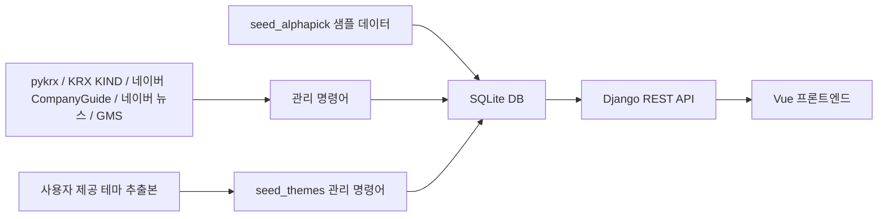
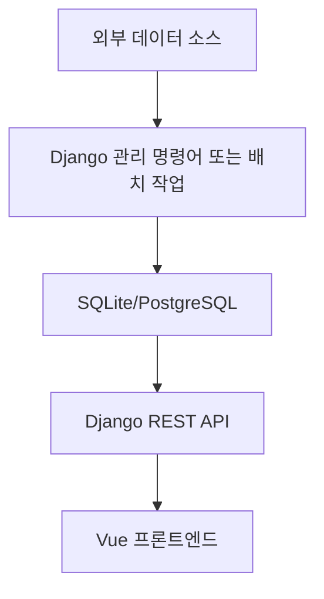

# 외부 데이터/API 연동 정리

본 문서는 AlphaPick이 외부에서 데이터를 가져오는 지점을 정리합니다. 현재 사용자 화면에서 프론트엔드가 외부 API를 직접 호출하는 구조는 없습니다. 외부 데이터는 관리 명령어로 수집한 뒤 DB에 저장하고, 화면은 Django REST API를 통해 DB 데이터를 조회합니다.

## 연동 현황 요약

| 구분 | 현재 상태 | 사용 위치 | 비고 |
|---|---|---|---|
| pykrx | 구현됨 | `seed_pykrx` 관리 명령어, 백테스트 벤치마크 보강 | 국내 주가/지수 데이터 수집 |
| KRX KIND 상장사 목록 | 구현됨 | `seed_pykrx` 관리 명령어 | pykrx 종목 목록 실패 시 KOSPI 상장사 목록 fallback |
| 네이버 CompanyGuide/WiseReport | 구현됨 | `seed_pykrx`, `refresh_financials` 관리 명령어 | 재무 지표 보강용 HTML/AJAX 조회 |
| 네이버 뉴스 검색 API | 구현됨 | `refresh_news_sentiment` 관리 명령어 | 종목별 최근 뉴스 수집 |
| GMS OpenAI Gateway | 구현됨 | AI 코멘트, 뉴스 감성 분석 | `gpt-5.4-nano` 기반 구조화 분석 |
| 사용자 제공 테마 추출본 | 구현됨 | `seed_themes` 관리 명령어 | 국내 종목 섹터·2차 테마 매핑 재가공 |
| OpenDART | 선택 구현 | `refresh_news_sentiment --include-dart` 관리 명령어 | `DART_API_KEY`가 있을 때 공식 공시 수집 |

## DB 데이터와 API 데이터 구분

현재 화면에서 보이는 종목/포트폴리오 데이터는 외부 API를 실시간 호출해서 표시하는 값이 아닙니다. 외부 데이터 수집 또는 샘플 데이터 적재 이후 SQLite DB에 저장되고, 프론트엔드는 우리 Django API를 통해 DB 데이터를 조회합니다.



현재 확인된 DB 저장 현황:

| 테이블 | 현재 개수 | 의미 | 주된 출처 |
|---|---:|---|---|
| `Stock` | 1,115 | 종목 기본 정보 | pykrx/KRX KIND 또는 seed 데이터 |
| `PriceDaily` | 269,585 | 일별 가격 데이터 | pykrx OHLCV |
| `FinancialMetric` | 1,115 | 재무/현재가/목표가 등 | pykrx 계산값 + 네이버 CompanyGuide 보강 |
| `ScoreSnapshot` | 1,115 | 종목별 점수 스냅샷 | DB 가격/재무 데이터 기반 내부 계산 |
| `PortfolioRun` | 1 | 포트폴리오 실행 결과 | 내부 포트폴리오 계산 |
| `PortfolioItem` | 49 | 편입 종목과 비중 | 내부 포트폴리오 계산 |
| `ThemeGroup` | 34 | 섹터/테마 그룹 | 사용자 제공 테마 추출본 + 내부 보정 |
| `Theme` | 101 | 2차 테마 | 사용자 제공 테마 추출본 + 내부 보정 |
| `StockTheme` | 1,713 | 종목-테마 연결 | 원문 기반 연결 1,205개 + 보정 연결 508개 |

화면별 데이터 출처:

| 화면/영역 | 프론트 호출 API | 실제 데이터 위치 | 외부 API 직접 호출 여부 |
|---|---|---|---|
| 메인 편입 종목 TOP 15 | `GET /api/portfolio/today/` | DB의 `Stock`, `ScoreSnapshot`, 내부 계산 결과 | 없음 |
| 오늘의 포트폴리오 전체 | `GET /api/portfolio/today/` | DB의 `Stock`, `ScoreSnapshot`, 내부 계산 결과 | 없음 |
| 종목 검색 | `GET /api/stocks/` | DB의 `Stock`, `ScoreSnapshot`, `FinancialMetric`, `StockTheme` | 없음 |
| 섹터·테마 패널 | `GET /api/themes/` | DB의 `ThemeGroup`, `Theme`, `StockTheme` | 없음 |
| 종목 리포트 | `GET /api/stocks/{ticker}/report/` | DB의 가격/재무/점수 테이블 | 없음 |
| 종목 차트 | 리포트 API 또는 `GET /api/stocks/{ticker}/prices/` | DB의 `PriceDaily` | 없음 |
| AI 코멘트 | `POST /api/stocks/{ticker}/ai-comment/` | DB 점수 기반 로컬 생성/캐시 | 없음 |
| 커뮤니티 | `/api/community/...` | DB의 커뮤니티 테이블 | 없음 |

정리하면, “외부 API로 불러온 데이터”는 현재 화면 렌더링 시점에 바로 호출되는 것이 아니라 `seed_pykrx` 같은 수집 명령어를 통해 DB에 먼저 적재됩니다. 프론트엔드가 호출하는 API는 모두 프로젝트 내부 Django API입니다.

테마 분류 역시 화면에서 외부 사이트를 직접 호출하지 않습니다. `seed_themes` 관리 명령어가 사용자가 제공한 국내 테마 추출본을 읽어 매핑 가능한 종목을 먼저 연결하고, 남은 종목은 DB의 업종/종목명 기반 보정 규칙으로 채웁니다.

## 현재 구현된 외부 연동

### 1. pykrx

| 항목 | 내용 |
|---|---|
| 라이브러리 | `pykrx==1.0.51` |
| 사용 파일 | `backend/stocks/management/commands/seed_pykrx.py`, `backend/stocks/services.py` |
| 목적 | 국내 종목 목록, OHLCV 가격 데이터, KOSPI 벤치마크 데이터 수집 |
| 인증키 | 불필요 |
| 실행 시점 | 사용자가 관리 명령어를 실행할 때 |

주요 사용 함수:

```txt
pykrx.stock.get_market_ticker_list()
pykrx.stock.get_market_ticker_name()
pykrx.stock.get_market_ohlcv_by_date()
pykrx.stock.get_index_ohlcv_by_date()
```

대표 실행 명령:

```powershell
cd backend
.\.venv\Scripts\python.exe manage.py seed_pykrx --market KOSPI --days 1095 --flush
```

테스트용 실행 예시:

```powershell
.\.venv\Scripts\python.exe manage.py seed_pykrx --tickers 005930,000660 --days 1095 --sleep 0 --flush
.\.venv\Scripts\python.exe manage.py seed_pykrx --market KOSPI --days 1095 --limit 30 --sleep 0.2 --flush
```

주의사항:

- pykrx는 공개 데이터 기반 라이브러리이므로 KRX 응답 상태에 영향을 받을 수 있습니다.
- 데이터 수집 실패 가능성을 고려해 `--limit`, `--sleep`, `--tickers` 옵션을 사용합니다.
- 운영 서비스처럼 고빈도 호출하기보다, 배치/관리 명령어 방식으로 수집하는 구조가 적합합니다.

### 2. KRX KIND 상장사 목록

| 항목 | 내용 |
|---|---|
| URL | `https://kind.krx.co.kr/corpgeneral/corpList.do?method=download&marketType=stockMkt` |
| 사용 파일 | `backend/stocks/management/commands/seed_pykrx.py` |
| 목적 | pykrx 종목 목록이 비어 있을 때 KOSPI 상장사 목록 fallback |
| 호출 방식 | `requests.get()` |
| 인증키 | 불필요 |

주의사항:

- KRX KIND 응답 포맷이 바뀌면 파싱 로직 수정이 필요할 수 있습니다.
- 현재는 KOSPI fallback 중심으로 사용합니다.

### 3. 네이버 CompanyGuide/WiseReport

| 항목 | 내용 |
|---|---|
| 기본 URL | `https://navercomp.wisereport.co.kr/v2/company/c1010001.aspx` |
| AJAX URL | `https://navercomp.wisereport.co.kr/v2/company/ajax/cF1001.aspx` |
| 사용 파일 | `backend/stocks/management/commands/seed_pykrx.py` |
| 목적 | 재무 지표 보강 |
| 호출 방식 | `requests.get()` |
| 인증키 | 불필요 |

수집/추출 대상:

| 데이터 | 설명 |
|---|---|
| ROE | 수익성 지표 |
| 영업이익률 | 수익성 지표 |
| 부채비율 | 안정성 지표 |

주의사항:

- HTML/AJAX 응답을 기반으로 추출하므로 사이트 구조 변경에 취약합니다.
- 요청 실패 시 재무 지표는 선택 데이터로 처리하고, 가격/점수 계산은 가능한 범위에서 진행합니다.
- 과도한 호출을 피하기 위해 `--sleep` 옵션 사용을 권장합니다.

### 4. 네이버 뉴스 검색 API + GMS 감성 분석

| 항목 | 내용 |
|---|---|
| 기본 URL | `https://openapi.naver.com/v1/search/news.json` |
| 사용 파일 | `backend/stocks/management/commands/refresh_news_sentiment.py` |
| 목적 | 종목별 최근 뉴스 수집, AI 기반 감성/영향도 분석, 종합 뉴스 감성 점수 산출 |
| 인증키 | `NAVER_CLIENT_ID`, `NAVER_CLIENT_SECRET`, 선택적으로 `GMS_KEY` |
| 요청 조건 | `query`, `display`, `start=1`, `sort=date` |
| 호출 한도 | 클라이언트 아이디 기준 하루 25,000회 |
| 저장 위치 | `ScoreSnapshot.news`, `ScoreSnapshot.disclosures`, `ScoreSnapshot.sentiment_score` |

대표 실행 명령:

```powershell
cd backend
.\.venv\Scripts\python.exe manage.py refresh_news_sentiment --tickers 005930 --display 10 --days 14
```

동작 방식:

- 네이버 뉴스 검색 API에서 종목명 기준 최근 뉴스를 가져옵니다.
- 제목과 요약에서 HTML 태그를 제거하고 유사 제목을 중복 제거합니다.
- `GMS_KEY`가 있으면 `gpt-5.4-nano`로 기사별 관련도, 이벤트 유형, 감성, 영향도, 신뢰도를 JSON으로 분류합니다.
- `GMS_KEY`가 없거나 AI 호출이 실패하면 제목/요약 키워드 기반 임시 분류로 대체합니다.
- 기사별 점수는 감성, 영향도, 관련도, 신뢰도, 최신성, 출처 가중치를 곱해 산출하고 0~100 뉴스 감성 점수로 변환합니다.

주의사항:

- 뉴스 본문 전체를 크롤링하지 않고 제목과 요약만 사용합니다.
- `--include-dart`와 `DART_API_KEY`를 함께 사용하면 OpenDART corp_code 매핑을 캐시한 뒤 공식 공시를 수집합니다.
- 뉴스가 없으면 화면에는 “최근 수집된 종목 관련 뉴스가 없습니다.”라고 표시하고 감성 집계에서는 제외합니다.

### 5. 사용자 제공 테마 추출본

| 항목 | 내용 |
|---|---|
| 상태 | 구현됨 |
| 사용 파일 | `backend/stocks/management/commands/seed_themes.py` |
| 목적 | 국내 종목의 섹터 그룹, 2차 테마, 종목-테마 연결 재가공 |
| 호출 방식 | 외부 API 호출 없음. 로컬 텍스트 파일을 읽어 DB 적재 |
| 인증키 | 불필요 |

대표 실행 명령:

```powershell
cd backend
.\.venv\Scripts\python.exe manage.py seed_themes --source "C:\path\to\domestic-themes.txt" --clear
```

현재 적재 결과:

| 항목 | 개수 |
|---|---:|
| 테마 그룹 | 34 |
| 2차 테마 | 101 |
| 종목-테마 연결 | 1,713 |
| 매핑된 활성 종목 | 1,115/1,115 |
| 원문 기반 연결 | 1,205 |
| 내부 보정 연결 | 508 |
| 원문에만 있고 현재 DB에 없는 티커 연결 | 3 |

주의사항:

- 현재 원문 텍스트는 DevTools에서 복사한 형태라 일부 배열이 생략 기호로 줄어들 수 있습니다.
- 더 완전한 CSV/JSON 원본이 생기면 같은 명령 구조로 원문 기반 매핑 비율을 높일 수 있습니다.
- 보정 규칙은 업종/종목명 기반 휴리스틱이므로 최종 서비스 전에는 주요 테마별 수동 검수가 필요합니다.

## 선택 연동 후보

### OpenDART

| 항목 | 내용 |
|---|---|
| 상태 | 공시 목록 수집 선택 구현 |
| 목적 | 기업 공식 공시 데이터 보강 |
| 인증키 | 필요 |
| 활용 화면 | 종목 리포트의 재무/공시 영역 |

활용 가능 데이터:

| 데이터 | 설명 |
|---|---|
| 정기보고서 | 사업보고서, 반기보고서, 분기보고서 |
| 재무제표 | 매출, 영업이익, 순이익, 자산, 부채 등 |
| 주요 공시 | 유상증자, 투자, 계약, 지분 변동 등 |

## 운영 시 권장 구조



권장 원칙:

- 프론트엔드에서 외부 API를 직접 호출하지 않고 백엔드에서 수집/정규화합니다.
- 외부 API 실패 시 기존 DB 데이터 또는 샘플 데이터를 반환합니다.
- 호출 제한이 있는 데이터는 배치 수집 후 캐시합니다.
- 외부 응답 포맷이 바뀔 수 있는 HTML 기반 데이터는 선택 데이터로 취급합니다.

## 환경 변수 후보

뉴스 감성 분석을 실제 수집 데이터로 실행하려면 네이버 뉴스 검색 API 키가 필요합니다. AI 분류는 `GMS_KEY`가 있으면 사용하고, 없으면 키워드 기반 임시 분류로 대체합니다.

```txt
NAVER_CLIENT_ID=
NAVER_CLIENT_SECRET=
NAVER_NEWS_URL=https://openapi.naver.com/v1/search/news.json
GMS_KEY=
DART_API_KEY=
DART_LIST_URL=https://opendart.fss.or.kr/api/list.json
```

## 제출/발표 시 설명 포인트

- 현재 프로젝트의 실제 외부 수집은 `seed_pykrx` 관리 명령어에서 수행합니다.
- 섹터·테마 분류는 `seed_themes` 관리 명령어로 DB에 적재하며, 화면에서는 내부 API만 조회합니다.
- 프론트엔드는 외부 API를 직접 호출하지 않고 내부 Django API만 호출합니다.
- 외부 API 장애가 화면 전체 장애로 번지지 않도록, 백엔드 API와 DB를 중간 계층으로 두는 구조입니다.
- `DART_API_KEY`가 있으면 OpenDART 공시 목록을 백엔드에서 수집해 종목 리포트의 공시 영역을 보강할 수 있습니다.
