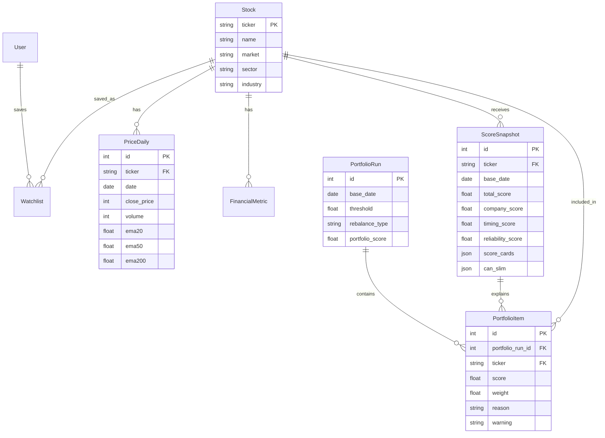
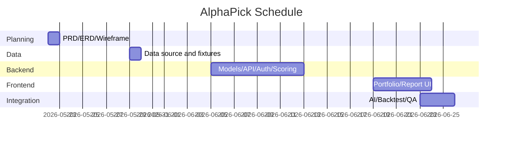

# AlphaPick Product Requirements Document

> Version v1.0 | 작성일 2026년 5월 22일 | 프로젝트 SSAFY 관통 프로젝트 금융 | 기술 스택 Django DRF + Vue 3 + Pinia + Chart.js + AI Comment API

## 1. 문제 정의

국내 개인 투자자는 종목을 고를 때 가격 차트, 수급, 재무제표, 뉴스, 공시를 여러 화면에서 따로 확인해야 한다. 정보는 많지만 “오늘 살 만한 종목이 무엇인지”와 “왜 그 종목이 추천되는지”를 한 번에 설명해주는 도구는 부족하다.

AlphaPick은 감이나 루머에 의존하는 종목 선택을 줄이고, 정량 점수와 설명 가능한 리포트를 기반으로 투자 후보를 압축하는 것을 목표로 한다.

| 페인포인트 | 설명 | 심각도 |
|---|---|---|
| 정보 파편화 | HTS, DART, 뉴스, 수급 데이터가 분산되어 종합 판단이 어렵다. | 높음 |
| 해석 장벽 | RSI, PER, ROE 같은 수치를 봐도 매수/관망 판단으로 연결하기 어렵다. | 높음 |
| 종목 선별 피로 | KOSPI/KOSDAQ의 많은 종목 중 검토 후보를 직접 좁히기 어렵다. | 매우 높음 |
| 매수 근거 부재 | 커뮤니티, 루머, 주변 추천에 의존해 감정적 매매를 반복한다. | 매우 높음 |
| 결과 검증 부족 | 추천이 실제로 지수보다 나은지 확인하기 어렵다. | 높음 |

## 2. 제품 개요

**AlphaPick**은 국내 주식 종목을 기업 점수, 타이밍 점수, 리스크 할인 계수로 점수화하고, `total_score >= 70`을 만족하는 추천 후보만 골라 **오늘의 알파 포트폴리오**를 구성하는 AI 기반 주식 분석 서비스다.

메인 화면은 단순 TOP 10 리스트가 아니라 **추천 포트폴리오**를 보여준다. 사용자는 편입 종목, 종목별 점수, 점수 비례 추천 비중, 핵심 추천 사유, 주의 사유를 확인할 수 있다. 각 종목을 클릭하면 KB 스타일의 상세 스코어 리포트에서 차트, CAN SLIM, 지표 카드, 뉴스/공시, AI 코멘트를 확인한다.

## 3. 핵심 차별화

| 차별화 요소 | 설명 |
|---|---|
| 70점 추천 후보 포트폴리오 | 기준 미달이면 추천하지 않는다. “항상 TOP N개”를 보여주는 방식보다 정직하다. |
| 초과 점수 비례 비중 | 추천 종목을 단순 나열하지 않고 70점 초과분 기준 포트폴리오 비중까지 제안한다. |
| 종목별 스코어 리포트 | 추천 결과의 근거를 차트, 지표 카드, CAN SLIM, 뉴스/공시로 설명한다. |
| AI 3줄 코멘트 | 복잡한 지표를 긍정 요인, 부정 요인, 종합 의견으로 요약한다. |
| 백테스트 검증 | 추천 포트폴리오가 KOSPI/KOSDAQ 대비 어떤 성과를 냈는지 비교한다. |
| 투자 성향 확장 | 공격형/중립형/안정형 가중치를 통해 개인화 포트폴리오로 확장 가능하다. |

## 4. 목표와 평가 지표

이번 프로젝트의 핵심 평가는 API 개수나 기능 나열이 아니라 다음 플로우가 안정적으로 동작하는지로 판단한다.

```txt
추천 포트폴리오 생성 → 종목 상세 리포트 조회 → 백테스트 검증
```

| 목표 | 평가 지표 | 수용 기준 |
|---|---|---|
| 추천 포트폴리오 생성 | 70점 이상 종목 필터링과 비중 계산 | 편입 종목 모두 70점 이상, 비중 합계 100% |
| 설명 가능한 리포트 | 상세 리포트 데이터 완성도 | 차트 1년치, 점수 카드, CAN SLIM, 기술/재무 지표 제공 |
| 추천 검증 | 백테스트 동작 | 포트폴리오와 KOSPI/KOSDAQ 수익률 비교 가능 |
| 재현성 | Fixtures 기반 실행 | 외부 API 없이 seed 데이터로 시연 가능 |
| 확장성 | AI/개인화 설계 | AI 코멘트와 투자 성향별 가중치 구조 반영 |

## 5. 점수 체계

### 5.1 3레이어 점수 구조

| 레이어 | 산식/역할 | 주요 지표 |
|---|---:|---|
| 기업 점수 | 가치/퀄리티 40% + 연간 ROE 30% + EPS 가속도 30% | PER/PBR, ROE, EPS 성장률 |
| 타이밍 점수 | 주도주/모멘텀 40% + 신고가/피벗 돌파 30% + 스마트머니/기관 수급 30% | RS, 피벗 돌파, 거래량/기관/외국인 |
| 리스크 할인 | 시장 방향 40% + 평균회귀 Z-Score 30% + 낙폭 위험도 30% | KOSPI/KOSDAQ 방향, 단기 과열, MDD/변동성 |

### 5.2 보조 점수

| 점수 | 설명 |
|---|---|
| `company_score` | 좋은 회사인지 판단하는 점수 |
| `timing_score` | 지금 진입 타이밍이 좋은지 판단하는 점수 |
| `reliability_score` | 데이터 결측, 최신성, 계산 가능 여부 기반 신뢰도 |
| `total_score` | 포트폴리오 편입 기준이 되는 최종 점수 |

### 5.3 투자 성향별 가중치

| 성향 | 기업 점수 | 타이밍 점수 |
|---|---:|---:|
| 공격형 | 38% | 62% |
| 중립형 | 45% | 55% |
| 안정형 | 62% | 38% |

MVP 기본값은 중립형이다. 회원 기능 확장 시 `UserProfile.risk_type`에 따라 점수를 재계산한다.

## 6. 포트폴리오 정책

### 6.1 편입 조건

```txt
total_score >= 70 (공통 컷오프)
성향별 개별 지표 허들:
- 공격형: company_score >= 65, timing_score >= 75, reliability_score >= 65
- 중립형: company_score >= 70, timing_score >= 70, reliability_score >= 70
- 안정형: company_score >= 75, timing_score >= 65, reliability_score >= 75
가격/재무/기술 지표 계산 가능
관리종목, 거래정지, 데이터 결측 과다 종목 제외
```

### 6.2 비중 산정 및 자산 배분

```txt
1. 시장 강도별(편입 성공 종목 수)로 기본 현금(Cash) 비중 선제 할당:
   - 5개 이상 편입 (강세): 현금 0%
   - 3~4개 편입 (중립): 현금 15%
   - 1~2개 편입 (약세): 현금 30%
   - 0개 편입 (위기): 현금 100% (관찰 후보만 표시)
2. 남은 주식 비중(100 - 현금%)을 편입 종목들에게 (total_score - 70) 비례로 배분.
3. 성향별 단일 섹터 비중 제한(Sector Cap) 적용:
   - 공격형: 최대 35% | 중립형: 최대 30% | 안정형: 최대 25%
4. Cap 초과 비중은 타 섹터 종목들에 비례 재배분하며, 분산 불가 시 현금(Cash)으로 강제 전환하여 귀속.
```

### 6.3 예외 처리

| 상황 | 처리 |
|---|---|
| 70점 이상 종목 0개 | “오늘은 편입 종목 없음” 표시 + 관찰 후보 TOP 5 표시 |
| 단일 섹터 편중 | “섹터 편중 주의” 배지 표시 |
| 편입 종목 1개 | 비중 100% 표시 + 분산 부족 경고 |
| 데이터 부족 종목 | “분석 준비 중” 표시 또는 포트폴리오 제외 |

### 6.4 갱신 주기

- 매일 장 마감 후 1회 갱신을 기본 정책으로 한다.
- MVP에서는 management command로 수동 갱신한다.
- 평가 환경에서는 fixtures/seed 데이터로 동일 결과를 재현한다.

## 7. 핵심 기능 명세

| ID | 기능 | 우선순위 | 설명 |
|---|---|---|---|
| F-01 | 1년치 주식 데이터 fixtures | Must | 가격 시계열, 재무, 점수, 포트폴리오 seed 데이터 제공 |
| F-02 | 3레이어 점수 계산/저장 | Must | 기업/타이밍/리스크 할인 기반 ScoreSnapshot 생성 |
| F-03 | 70점 추천 후보 포트폴리오 | Must | 70점 이상 종목만 편입 |
| F-04 | 초과 점수 비례 비중 산정 | Must | PortfolioItem.weight 계산 |
| F-05 | 메인 포트폴리오 화면 | Must | 포트폴리오 총점, 종목 카드, 비중, 관찰 후보 표시 |
| F-06 | 종목 상세 스코어 리포트 | Must | 차트, 타이밍 카드, CAN SLIM, 지표 카드, 뉴스/공시 |
| F-07 | 검색/필터 | Must | 종목명, 티커, 섹터, 점수 구간 검색 |
| F-08 | 백테스트 | Must | 포트폴리오 vs KOSPI/KOSDAQ 누적 수익률 비교 |
| F-09 | AI 3줄 코멘트 | Should | 긍정 요인, 부정 요인, 종합 의견 생성 및 캐싱 |
| F-10 | 회원가입/로그인 | Should | JWT 기반 인증 |
| F-11 | 관심 종목 | Should | 회원별 Watchlist 저장/삭제 |
| F-12 | 투자 성향 설정 | Should | 공격/중립/안정형 가중치 반영 |
| F-13 | 뉴스 감성 히스토리 | Nice | 일자별 뉴스 감성 추적 |
| F-14 | 포트폴리오 변경 알림 | Nice | 편입/제외 변화 알림 |
| F-15 | 성향별 다이내믹 허들 | Should | 투자 성향에 따른 가치/타이밍/신뢰도 편입 허들 세분화 |
| F-16 | 시장 상황별 현금 자산 배분 | Should | 편입 수 기반 시장 판단 및 포트폴리오 내 Cash 배정 |
| F-17 | Sector Cap 및 초과 비중 재분배 | Should | 단일 산업 쏠림 제어 및 분산 불가 비중의 현금 귀속 |

## 8. 주요 화면

### 8.1 Home: 오늘의 알파 포트폴리오

- 포트폴리오 총점
- 기준일
- 편입 종목 수
- 점수 비례 추천 비중
- 편입 종목 카드
- 관찰 후보 TOP 5
- 백테스트 요약
- 투자 유의 문구

### 8.2 Stock Report: 종목별 스코어 리포트

- 종목명, 티커, 업종
- 큰 진단 문구
- 핵심 요약 지표
- 추세/모멘텀/변동성/수급 카드
- 가격 차트 1년치: Close, EMA20, EMA50, EMA200, Bollinger Band, Volume
- 종합 점수, 회사 점수, 타이밍 점수
- CAN SLIM 분석
- 기업/타이밍/리스크 점수 카드
- 기술 지표
- 재무 지표
- 뉴스/공시
- AI 3줄 코멘트 영역

### 8.3 Backtest

- 포트폴리오 누적 수익률
- KOSPI/KOSDAQ 누적 수익률
- 승률
- 최대 낙폭
- 일별 리밸런싱 테이블

## 9. 사용자 플로우

### 9.1 핵심 시연 플로우

1. 사용자가 메인 화면에 접속한다.
2. 시스템은 중립형 기준 오늘의 알파 포트폴리오를 보여준다.
3. 사용자는 편입 종목, 점수, 추천 비중, 추천 사유를 확인한다.
4. 사용자가 종목 카드를 클릭한다.
5. 시스템은 1년치 차트와 스코어 리포트를 보여준다.
6. 사용자는 CAN SLIM, 지표 카드, 기술/재무 지표, 뉴스/공시를 확인한다.
7. 사용자는 백테스트 화면에서 추천 포트폴리오와 지수 수익률을 비교한다.

### 9.2 확장 플로우

1. 사용자가 회원가입/로그인을 한다.
2. 투자 성향을 공격형/중립형/안정형 중 선택한다.
3. 시스템은 성향별 가중치로 포트폴리오를 재계산한다.
4. 사용자는 관심 종목을 저장한다.
5. 종목 상세에서 AI 분석 보기를 누른다.
6. 시스템은 AI 3줄 코멘트를 생성하거나 캐시된 결과를 반환한다.

## 10. API 명세

| Method | Endpoint | 설명 | 인증 |
|---|---|---|---|
| GET | `/api/portfolio/today/` | 오늘의 알파 포트폴리오 | Optional |
| GET | `/api/portfolio/history/` | 포트폴리오 이력 | Optional |
| GET | `/api/portfolio/backtest/?benchmark=KOSPI` | 백테스트 | Optional |
| GET | `/api/stocks/` | 종목 검색/필터 | Optional |
| GET | `/api/stocks/{ticker}/report/` | 종목 상세 스코어 리포트 | Optional |
| GET | `/api/stocks/{ticker}/prices/` | 1년치 가격 시계열 | Optional |
| POST | `/api/watchlist/{ticker}/` | 관심 종목 추가 | Required |
| DELETE | `/api/watchlist/{ticker}/` | 관심 종목 삭제 | Required |
| GET | `/api/watchlist/` | 내 관심 종목 목록 | Required |
| POST | `/api/auth/register/` | 회원가입 | Public |
| POST | `/api/auth/login/` | 로그인 | Public |
| POST | `/api/auth/refresh/` | 토큰 갱신 | Public |
| POST | `/api/stocks/{ticker}/ai-comment/` | AI 3줄 코멘트 생성 | Required, Phase 2 |

## 11. 응답 스키마 예시

```ts
Portfolio {
  baseDate: string
  portfolioScore: number
  rebalanceType: "daily"
  threshold: 70
  userRiskType: "neutral" | "aggressive" | "stable"
  summary: string
  sectorWarning: string
  items: PortfolioItem[]
  watchCandidates: StockSummary[]
  benchmarkSummary: BenchmarkSummary
}

PortfolioItem {
  ticker: string
  name: string
  market: string
  sector: string
  totalScore: number
  companyScore: number
  timingScore: number
  reliabilityScore: number
  weight: number
  reason: string
  warning: string
}
```

```ts
StockReport {
  stock: StockSummary
  score: ScoreSnapshot
  financialMetric: FinancialMetric
  priceSeries: PricePoint[] // 365 rows
  investmentNotice: string
}
```

## 12. 데이터 모델



## 13. WBS / 일정

| 날짜 | 작업 | 산출물 |
|---|---|---|
| 2026-05-22 | PRD 확정, 포트폴리오 정책 확정, ERD/Use Case/와이어프레임 작성 | PRD v1.0 |
| 2026-05-29 | 주식 데이터 소스 검증, 1년치 fixtures 생성 | seed 데이터 |
| 2026-06-05 | Django 모델/API/Auth 기본 구현 | Stock/Score/Portfolio/Auth API |
| 2026-06-12 | 3레이어 점수 엔진, 70점 추천 후보 포트폴리오 로직 구현 | 추천 엔진 |
| 2026-06-19 | Vue 메인/상세/검색/백테스트 화면 구현 | 프론트 MVP |
| 2026-06-22 | KB 스타일 상세 리포트, 차트, 지표 카드 고도화 | 상세 대시보드 |
| 2026-06-23 | AI 코멘트, 관심 종목, 성향별 가중치 확장 | 개인화/AI 기능 |
| 2026-06-24 | QA, README, 발표자료, 산출물 정리 | 최종 제출 문서 |
| 2026-06-25 | 최종 테스트 및 발표 | 최종본 |



## 14. 수용 기준

- 메인 화면에 70점 이상 추천 후보만 포트폴리오로 표시된다.
- 포트폴리오 비중은 70점 초과분 비례 방식으로 계산되며 합계가 100%다.
- 70점 이상 종목이 없으면 관찰 후보 TOP 5가 표시된다.
- 종목 상세 리포트는 1년치 가격 데이터와 핵심 지표를 제공한다.
- 종목 상세 리포트에는 타이밍 카드, CAN SLIM, 점수 카드, 기술/재무 지표, 뉴스/공시가 포함된다.
- 백테스트 화면에서 추천 포트폴리오와 KOSPI/KOSDAQ 수익률을 비교할 수 있다.
- 검색 화면에서 종목 중복이 발생하지 않는다.
- fixtures/seed만으로 프로젝트 실행과 평가가 가능하다.
- 최종 평가 플로우 `추천 포트폴리오 생성 → 상세 리포트 → 백테스트`가 정상 동작한다.
- 모든 화면에 투자 참고용 서비스이며 수익을 보장하지 않는다는 면책 문구를 포함한다.

## 15. Assumptions and Out of Scope

### Assumptions

- MVP 대상은 KOSPI/KOSDAQ 종목이다.
- 포트폴리오는 매일 장 마감 후 1회 갱신한다.
- 기본 편입 기준은 `total_score >= 70`이다.
- 기본 투자 성향은 중립형이다.
- 외부 API 장애를 대비해 1년치 fixtures를 함께 제공한다.

### Out of Scope

- 실제 매수/매도 주문
- WebSocket 기반 틱 단위 실시간 스트리밍
- 유료 결제/구독
- 종목 커뮤니티/댓글
- 수익률 보장 또는 투자 자문 행위

## 16. 최종 요약

AlphaPick의 핵심은 “좋아 보이는 종목 10개를 보여주는 서비스”가 아니다.  
매일 전체 종목을 점수화한 뒤 **70점 이상 추천 후보만 통과시키고**, 통과한 종목을 **70점 초과분 비례 포트폴리오**로 구성하며, 각 종목의 편입 근거를 **상세 스코어 리포트**로 설명하고, 마지막으로 **백테스트**로 추천 품질을 검증하는 서비스다.  
