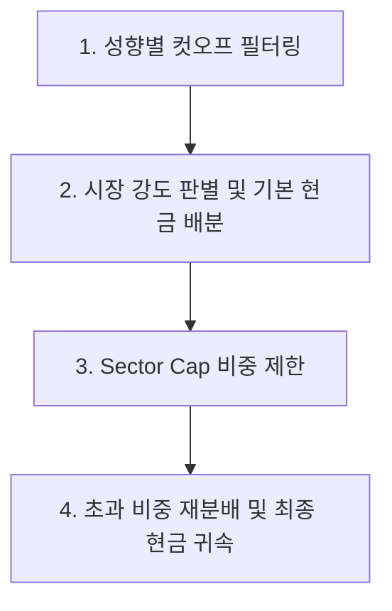

# Feature Specification - Portfolio Recommendation Engine Optimization

본 문서는 AlphaPick 추천 포트폴리오의 운용 현실성과 리스크 제어력을 대폭 강화하기 위한 추천 로직 고도화 기능 명세서입니다. 

기존의 단순 정량 점수 필터링을 넘어 투자 성향별 정밀 필터, 시장 분위기에 따른 자산 배분(현금), 그리고 특정 부문 쏠림을 제어하는 분산 투자 메커니즘을 정의합니다.

---

## 1. 개요 및 배경

기존 AlphaPick MVP는 모든 투자 성향(공격/중립/안정형)에 동일한 편입 컷오프(회사 60점, 타이밍 60점)를 일괄 적용하여 성향에 따른 변별력이 부족했습니다. 또한, 특정 섹터에 비중이 쏠리거나 하락장에서 현금 대피선 없이 주식만 100% 매수하는 리스크에 노출되어 있었습니다.

이를 극복하기 위해 추천 엔진(`backend/stocks/services.py`)에 다음 3대 자산 배분 및 리스크 관리 알고리즘을 도입합니다.

---

## 2. 핵심 요구사항 및 상세 사양

### 2.1. 투자 성향별 편입 조건(Cut-off) 세분화
투자자의 리스크 감내 수준과 중점 투자 포인트에 맞춰 개별 컴포넌트 점수 허들을 차별화합니다.

| 투자 성향 (`risk_type`) | 회사 가치 점수 허들 | 진입 타이밍 점수 허들 | 데이터 신뢰도 점수 허들 | 의미 |
|---|---|---|---|---|
| **공격형 (Aggressive)** | `company_score >= 65` | `timing_score >= 75` | `reliability_score >= 65` | 타이밍과 모멘텀 추종 중시 |
| **중립형 (Neutral)** | `company_score >= 70` | `timing_score >= 70` | `reliability_score >= 70` | 가치와 모멘텀의 균형 |
| **안정형 (Stable)** | `company_score >= 75` | `timing_score >= 65` | `reliability_score >= 75` | 우량주 가치와 데이터 최신성 중시 |

- **최종 점수 컷오프**: 성향별 컴포넌트 가중치가 반영되어 산출된 최종 리스크 조정 점수(`total_score`)에 대한 최소 편입 컷오프는 **70점**으로 공통 유지합니다.
- **적용 대상**: `backend/stocks/services.py` 내 `portfolio_candidates()` 및 `build_dynamic_portfolio_payload()`의 동적 필터링 부분에 반영됩니다.

### 2.2. 시장 상황 기반 현금 비중 추천 (자산 배분)
편입 조건을 통과한 우량/모멘텀 주식 종목의 개수(Market Breath)를 전체 시장의 단기 강도 지표로 삼아 현금(Cash) 자산 비중을 탄력적으로 조절합니다.

- **시장 강도 판별식 및 기본 현금 비중**:
  - **강세장** (편입 성공 종목 **5개 이상**): 주식 편입 여력이 충분하므로 **기본 현금 비중 0%**
  - **중립장** (편입 성공 종목 **3 ~ 4개**): 시장 과열 및 쏠림에 대비해 **기본 현금 비중 15%**
  - **약세장** (편입 성공 종목 **1 ~ 2개**): 리스크 방어를 강화하기 위해 **기본 현금 비중 30%**
  - **위기장** (편입 성공 종목 **0개**): 주식 비중을 아예 두지 않고 **현금 비중 100%**로 대피 (관찰 후보 TOP 5만 화면 노출)
- **자산 배분 배정 메커니즘**:
  - 포트폴리오의 전체 비중 100% 중 현금 비중을 선제 배정합니다.
  - 나머지 주식 자산 할당 비중(`100% - 현금비중`)을 기준으로 편입 종목들에게 점수 비례 가중치를 나누어 배분합니다.
  - 포트폴리오 아이템 API 응답 스키마와 화면(`frontend/src/views/HomeView.vue`)에 `"현금 (Cash)"` 항목이 개별 자산 카드로 표시됩니다.

### 2.3. 섹터 비중 제한 (Sector Cap) 및 강제 분산
특정 산업군에 비중이 과도하게 쏠리는 것을 방지하기 위해 성향별로 단일 섹터의 최대 보유 한도(Sector Cap)를 강제합니다.

- **성향별 최대 섹터 비중 (Sector Cap)**:
  - **공격형**: 최대 35%
  - **중립형**: 최대 30%
  - **안정형**: 최대 25%
- **초과 비중 재분배 알고리즘**:
  1. 1차적으로 `total_score - 70` 비례 비중으로 주식 종목들에 비중을 임시 배정합니다.
  2. 단일 섹터에 속한 종목들의 비중 합계가 성향별 Sector Cap을 초과할 경우, 초과분 비중(Excess Weight)을 해당 섹터 종목들로부터 차감하여 Cap 한도까지 잘라냅니다.
  3. 추출된 초과분 비중은 Cap 한도에 도달하지 않은 **다른 섹터의 종목들에게 점수 비례로 재분배**합니다.
  4. 만약 다른 섹터의 종목이 없거나 부족하여 Cap 제한을 지키면서 100%를 구성하는 것이 불가능한 경우(예: 편입 성공 종목이 모두 동일 섹터인 경우 등), 분산이 불가능한 초과 비중은 **현금(Cash) 비중으로 강제 전환하여 안전하게 귀속**시킵니다.
  5. 비중 조정 발생 시 API 응답의 `sectorWarning` 또는 별도 알림 상태를 통해 사용자에게 비중 조정 내역을 안내합니다.

---

## 3. 예시 시나리오 및 시뮬레이션

### 시나리오 A: 중립형 투자자 (종목 4개 편입, 섹터 편중 발생)
- **상황**:
  - 편입 성공 종목: 삼성전자(반도체, 85점), SK하이닉스(반도체, 82점), 한미반도체(반도체, 75점), KB금융(금융, 72점)
- **계산 흐름**:
  1. 편입 종목 4개이므로 시장은 **중립장**으로 판별되어 **기본 현금 비중 15%**를 먼저 배정합니다.
  2. 남은 주식 비중 **85%**를 초과점수(`score - 70`) 비례로 4개 종목에 1차 배분합니다:
     - 초과점수: 삼성전자(15), SK하이닉(12), 한미반도(5), KB금융(2) -> 합계 34
     - 1차 비중: 삼성(37.5%), 하이닉(30.0%), 한미(12.5%), KB(5.0%)  [합계 85%]
  3. 섹터 합산:
     - **반도체 섹터**: 삼성 + 하이닉 + 한미 = **80%**
     - **금융 섹터**: KB = **5%**
  4. Sector Cap 적용: 중립형의 Sector Cap은 **30%**입니다. 반도체 섹터의 비중 합계가 30%로 강제 컷오프되며, 초과 비중 **50%**가 추출됩니다.
  5. 초과 비중 재분배:
     - 초과분 50%를 다른 섹터인 금융 섹터(KB금융)로 재분배하려 하나, 금융 섹터 역시 중립형 Cap인 **30%** 제한에 걸립니다.
     - KB금융에 가용할 수 있는 최대 재분배 한도는 `30% - 5% = 25%`입니다. KB금융은 30%가 배정되고, 재분배되지 못한 나머지 초과 비중 **25%**가 발생합니다.
  6. 최종 현금 귀속:
     - 갈 곳 없는 초과 비중 25%는 현금으로 강제 전환됩니다.
  7. **최종 포트폴리오 구성**:
     - 반도체 섹터 (삼성, 하이닉, 한미): 합계 **30%** (점수 비율대로 배분)
     - 금융 섹터 (KB금융): **30%**
     - 현금 (Cash): 기본 15% + 귀속 25% = **40%**
     - *결과*: 특정 테마 쏠림을 제어하고, 대피 자산(현금) 비중을 40%로 높여 분산 리스크를 자동 방어하였습니다.

---

## 4. 구현 및 데이터 매핑 (Repo-relative References)

- **백엔드 추천 엔진**: [stocks/services.py](file:///backend/stocks/services.py)의 `build_dynamic_portfolio_payload()` 내에서 자산 배분 알고리즘을 수행하며, `TodayPortfolioView`([stocks/views.py](file:///backend/stocks/views.py#L68))를 통해 프론트에 전달됩니다.
- **프론트엔드 포트폴리오 대시보드**: [frontend/src/views/HomeView.vue](file:///frontend/src/views/HomeView.vue)에서 전달된 현금 비중 및 주식 비중을 시각화하고, 섹터 한도 경고 배지를 표출합니다.
