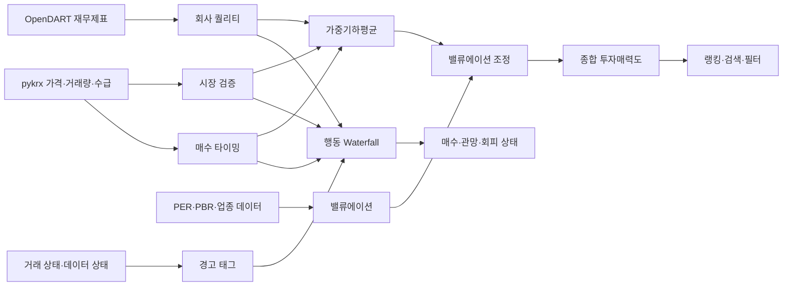

# AlphaPick 종목 점수 및 매매 신호 로직

> **버전**: v4 Final Design  
> **문서 목적**: 약 1,000개 국내 상장 종목을 정형 데이터 기반으로 일괄 평가하고, 회사의 질·시장 검증·현재 매수 타이밍을 각각 계산한 뒤 하나의 합리적인 **종합 투자매력도 점수**로 결합한다.  
> **핵심 원칙**: 종합점수는 제공하되, 세부 점수와 행동 신호를 숨기지 않는다. 종합점수는 랭킹과 후보 압축에 사용하고, 실제 매수·관망·회피 상태는 별도의 행동 규칙으로 결정한다.

---

## 1. 최종 설계 요약

AlphaPick은 다음 세 가지 독립 점수를 먼저 계산한다.

1. **회사 퀄리티 점수**
   - 이 회사의 사업 성과와 재무 상태가 좋은가?
2. **시장 검증 점수**
   - 시장이 이 기업을 중장기적으로 긍정적으로 평가하고 있는가?
3. **매수 타이밍 점수**
   - 현재 가격·수급·추세 기준으로 지금 진입하기 좋은가?

세 점수는 가중기하평균으로 결합해 `0~100점`의 종합 투자매력도를 만든다.

```text
종합 투자매력도
= 회사 퀄리티 40%
+ 시장 검증 25%
+ 매수 타이밍 35%
```

단, 실제 계산은 단순 가중합이 아니라 가중기하평균을 사용한다.

```text
기본 종합점수
= 100
× (회사 퀄리티 / 100)^0.40
× (시장 검증 / 100)^0.25
× (매수 타이밍 / 100)^0.35
```

밸류에이션은 별도 점수축으로 만들지 않고 종합점수에 제한적인 가감점으로 반영한다.

```text
저평가     +4점
적정        0점
부담       -3점
고평가     -7점
비교 불가   0점
```

최종 사용자 화면:

```text
종합 투자매력도 64점

회사 퀄리티 84
시장 검증 77
매수 타이밍 46
밸류에이션 부담

우량 기업 · 신규 매수 대기
```

---

## 2. 설계 목표

### 2.1 종합점수의 목적

종합점수는 다음 목적으로 사용한다.

```text
1,000여 개 종목의 일괄 랭킹
상위 투자 후보 압축
섹터·테마 내 종목 비교
검색 및 필터 정렬
관심 종목 우선순위 제공
```

종합점수는 다음 목적으로 사용하지 않는다.

```text
점수만으로 자동 매수 확정
수익률 보장
세부 위험과 진입 위치를 숨기는 단일 판단
```

### 2.2 기존 단일 가중합 방식의 문제

기존 구조에서는 가치·퀄리티, 모멘텀, 리스크, 뉴스 감성처럼 성격이 다른 요소가 한 번에 합산됐다.

이 경우 다음 문제가 발생한다.

```text
뉴스 감성이 높아 낮은 리스크 점수를 덮음
모멘텀이 강해 재무가 약한 종목이 우량주로 보임
좋은 회사지만 과열된 종목이 높은 매수 점수를 받음
같은 종합점수라도 종목의 성격이 완전히 다름
```

새로운 구조는 세부 점수를 독립 계산한 뒤 종합점수로 결합한다. 따라서 종합점수를 유지하면서도 그 점수가 만들어진 이유를 설명할 수 있다.

---

## 3. 퀀트 모델링 관점의 핵심 설계 원칙

### 3.1 서로 다른 경제적 의미를 가진 팩터를 분리한다

퀀트 모델에서 팩터는 서로 다른 가설을 표현해야 한다.

```text
회사 퀄리티
→ 기업의 장기 생존력과 이익 창출 능력

시장 검증
→ 시장 참여자가 이미 가격에 반영한 중장기 평가

매수 타이밍
→ 현재 진입의 유리함과 단기 위험
```

재무와 가격을 같은 세부 점수 안에서 섞으면 어떤 가설이 성과를 만들었는지 분석하기 어렵다. 독립된 팩터로 유지하면 다음이 가능하다.

```text
팩터별 성과 분석
가중치 변경 효과 확인
특정 점수의 오류 추적
시장 국면별 팩터 성과 비교
```

### 3.2 점수의 독립성과 종합점수의 실용성을 동시에 유지한다

세 점수를 완전히 분리만 하면 사용자는 1,000개 종목을 빠르게 비교하기 어렵다. 반대로 하나의 점수만 보여주면 해석 가능성이 떨어진다.

따라서 다음 두 계층을 사용한다.

```text
상위 계층:
종합 투자매력도

하위 계층:
회사 퀄리티
시장 검증
매수 타이밍
밸류에이션
경고 태그
```

### 3.3 단순 가중평균보다 가중기하평균을 사용한다

단순 가중평균은 한 점수가 매우 낮아도 다른 높은 점수가 이를 쉽게 상쇄한다.

예시:

```text
회사 퀄리티 95
시장 검증 90
타이밍 25
```

단순 가중평균:

```text
95 × 0.40
+ 90 × 0.25
+ 25 × 0.35
= 69.25점
```

타이밍이 25점인데도 종합점수가 약 69점이 된다. 사용자는 이를 매수 가능한 종목으로 오해할 수 있다.

가중기하평균은 세 축을 상호 보완적 조건으로 본다. 한 축이 크게 부족하면 전체 점수를 자연스럽게 낮춘다.

시스템 트레이딩 관점에서는 이를 **병목 효과**로 해석할 수 있다.

```text
좋은 회사
+ 시장 검증
+ 적절한 진입 위치

세 조건이 함께 갖춰질수록 종합 매력도가 높음
```

### 3.4 종합점수와 행동 신호를 분리한다

종합점수는 랭킹용이다. 행동 신호는 실제 진입 여부를 결정한다.

```text
종합점수
→ 어떤 종목을 먼저 볼 것인가?

행동 신호
→ 지금 매수·관망·회피 중 무엇인가?
```

같은 종합점수라도 구성은 다를 수 있다.

```text
종목 A
회사 84 / 시장 77 / 타이밍 46
→ 우량 기업 · 신규 매수 대기

종목 B
회사 45 / 시장 82 / 타이밍 86
→ 단기 트레이딩 후보
```

따라서 종합점수 구간만으로 행동을 결정하지 않는다.

---

## 4. 전체 시스템 흐름



전체 계산 과정:

```text
1. 종목 유니버스 생성
2. 원천 데이터 수집
3. 데이터 정합성 검사
4. 이상치 처리
5. 세부 지표 계산
6. 세부 지표를 0~100점으로 정규화
7. 회사 퀄리티 계산
8. 시장 검증 계산
9. 매수 타이밍 기본점수 계산
10. 과열·시장 국면·하방 위험 할인
11. 가중기하평균으로 기본 종합점수 계산
12. 밸류에이션 가감점 적용
13. 행동 Waterfall 적용
14. 한 줄 코멘트 생성
15. DB 저장 및 랭킹 제공
```

---

## 5. 데이터 원천과 갱신 주기

| 데이터 | 원천 | 권장 갱신 주기 | 사용 위치 |
|---|---|---:|---|
| OHLCV | pykrx | 장 마감 후 1회 | 시장 검증, 타이밍 |
| 거래량·거래대금 | pykrx | 장 마감 후 1회 | 수급, 유동성 |
| 외국인·기관 순매수 | pykrx 또는 대체 데이터 | 장 마감 후 1회 | 타이밍 |
| EMA, OBV, ATR, MDD, Z-Score | 내부 계산 | 가격 갱신 후 | 시장 검증, 타이밍 |
| 매출·영업이익·자본·부채 | OpenDART | 신규 분기 공시 시 | 회사 퀄리티 |
| 영업현금흐름 | OpenDART | 신규 분기 공시 시 | 회사 퀄리티 |
| PER·PBR·ROE | 네이버 금융 또는 구조화 데이터 | 일 1회 또는 주 1~2회 | 밸류에이션 |
| 거래정지·관리 상태 | 거래소 또는 종목 상태 데이터 | 하루 1~2회 | 경고 태그 |
| 최근 주요 공시 제목 | OpenDART | 신규 공시 수집 시 | 상세 참고 |
| 뉴스 | 네이버 뉴스 등 | 상세 페이지 요청 시 | 참고 정보 |

### 5.1 재계산 주기 분리

```text
매일 재계산:
- 시장 검증
- 타이밍
- 종합 투자매력도
- 밸류에이션 상태
- 가격 기반 경고

신규 재무제표 발생 시:
- 회사 퀄리티
- 재무 경고 태그
- 종합 투자매력도
```

회사 퀄리티는 매일 변하지 않으므로 전체 재무 데이터를 매일 다시 수집하지 않는다.

---

## 6. 뉴스와 공시 처리

### 6.1 뉴스 감성 점수 제외

약 1,000개 종목의 다수 뉴스를 AI로 분석하면 다음 문제가 발생한다.

```text
토큰 비용 증가
처리 시간 증가
중복 기사 제거 비용
대형주 중심 뉴스 커버리지 편향
동일 입력에 대한 재현성 저하
```

따라서 뉴스 감성은 전체 종합점수에 넣지 않는다.

```text
전체 종목 점수
→ 정형 데이터와 규칙 기반 계산

뉴스
→ 상위 후보 또는 상세 페이지 참고
```

### 6.2 공시 처리

공시 원문 전체를 AI로 평가하지 않는다.

```text
최근 주요 공시 제목
거래 상태
재무제표
구조화된 공시 유형
```

을 참고 정보와 경고 태그로 사용한다.

횡령·자진상폐·일시 거래정지의 의미를 자동으로 투자 적격·부적격으로 판정하지 않는다.

---

## 7. 데이터 전처리와 정규화

## 7.1 점수 범위

모든 세부 점수는 `0~100점`으로 변환한다.

```text
0점
→ 해당 팩터에서 최하위 수준

50점
→ 중립 또는 중앙값 수준

100점
→ 해당 팩터에서 최상위 수준
```

### 7.2 이상치 처리

재무 성장률과 수익률은 극단값이 빈번하다.

예시:

```text
전년 영업이익이 매우 작았던 기업의 성장률 2,000%
일회성 이익으로 ROE 급등
신규 상장 종목의 극단적 수익률
```

권장 처리:

```text
1차:
논리적으로 계산 불가능한 값 제거

2차:
업종 내 1~99백분위 Winsorization

3차:
0~100 백분위 점수 변환
```

Winsorization은 극단값을 제거하는 것이 아니라 경계값으로 제한해 전체 순위를 왜곡하지 않도록 한다.

### 7.3 절대평가와 업종 상대평가

업종마다 정상적인 재무 구조가 다르다.

```text
금융업의 높은 부채
반도체의 경기 변동
바이오의 장기 적자
플랫폼 기업의 낮은 유형자산
```

따라서 절대 기준과 업종 상대 기준을 혼합한다.

| 지표 성격 | 절대평가 | 업종 상대평가 |
|---|---:|---:|
| 매출·이익 성장성 | 30% | 70% |
| ROE·영업이익률 | 40% | 60% |
| 부채·현금흐름 | 70% | 30% |
| 상대강도 | 20% | 80% |
| 하방 변동성 | 40% | 60% |

퀀트 모델링 관점의 이유:

```text
성장성과 수익성
→ 업종의 성장률과 마진 구조 차이가 큼

부채와 현금흐름
→ 업종 평균이 나쁘더라도 절대적인 생존 위험은 존재

상대강도
→ 시장 및 업종 내 순위가 더 중요
```

### 7.4 결측치

결측치를 0점으로 처리하지 않는다.

```text
0점
→ 데이터가 있고 실제로 매우 나쁨

null
→ 데이터가 없어 계산할 수 없음
```

사용 가능한 항목만으로 가중치를 재정규화한다.

단, 데이터 신뢰도 점수를 별도로 저장한다.

```json
{
  "score": 76.0,
  "data_confidence": 48,
  "warnings": ["재무 데이터 부족"]
}
```

### 7.5 미래 정보 사용 방지

백테스트와 운영 계산에서는 실제 공개 시점 이후에만 재무 데이터를 사용해야 한다.

```text
분기 종료일 기준 사용 금지
공시 제출일 이후 사용
정정 공시는 정정 공시 이후 반영
```

이를 지키지 않으면 Look-ahead Bias가 발생한다.

---

## 8. 회사 퀄리티 점수

### 8.1 질문

> 이 회사의 사업 성과와 재무 상태가 좋은가?

가격과 거래량은 회사 퀄리티에 포함하지 않는다.

### 8.2 공식

```text
회사 퀄리티
= 성장성 30%
+ 수익성·자본 효율성 30%
+ 재무 건전성 25%
+ 현금흐름·이익의 질 15%
```

### 8.3 왜 이 가중치인가

#### 성장성 30%

장기 주가 상승은 결국 이익과 매출 성장의 지속성에서 나온다. 그러나 성장률만 높고 수익성과 현금흐름이 약한 기업을 과대평가하지 않기 위해 30%로 제한한다.

#### 수익성·자본 효율성 30%

같은 매출 성장이라도 높은 마진과 ROE를 유지하는 기업이 자본을 효율적으로 사용한다. 성장성과 동일 비중을 두어 “성장하되 돈을 버는 회사”를 선호한다.

#### 재무 건전성 25%

시스템 트레이딩에서 큰 손실은 평균적인 저수익보다 파산·자금조달·희석 위험에서 발생한다. 부채와 차입 부담은 상승 잠재력보다 하방 위험 통제에 가깝기 때문에 25%를 배정한다.

#### 현금흐름·이익의 질 15%

회계상 이익은 발생했지만 현금이 들어오지 않는 기업을 걸러낸다. 데이터 누락 가능성과 업종별 특성을 고려해 15%로 설정한다.

---

### 8.4 성장성: 30점

| 항목 | 비중 |
|---|---:|
| 매출 YoY | 15 |
| 영업이익 성장·턴어라운드 | 15 |

```text
매출 YoY
= (최근 분기 매출 - 전년 동기 매출)
  / 전년 동기 매출
```

영업이익은 전년 값이 음수이면 단순 성장률을 사용하지 않는다.

```text
흑자 유지 + 증가
→ 높은 점수

적자에서 흑자 전환
→ 높은 턴어라운드 점수

적자 유지 + 적자폭 감소
→ 중간 점수

흑자에서 적자 전환
→ 낮은 점수

적자 유지 + 적자폭 확대
→ 매우 낮은 점수
```

### 8.5 수익성·자본 효율성: 30점

| 항목 | 비중 |
|---|---:|
| ROE | 15 |
| 영업이익률 | 15 |

```text
영업이익률
= 영업이익 / 매출액 × 100
```

ROE는 부채로 높아질 수 있으므로 재무 건전성과 함께 본다.

### 8.6 재무 건전성: 25점

| 항목 | 비중 |
|---|---:|
| 부채비율 | 15 |
| 순현금·차입금 부담 | 10 |

```text
부채비율
= 부채총계 / 자본총계 × 100
```

```text
순현금
= 현금 및 현금성 자산
+ 단기금융자산
- 단기차입금
- 장기차입금
- 사채
```

총부채 전체를 순현금 계산에 사용하지 않는다. 매입채무와 선수금처럼 정상적인 영업 부채까지 차감하면 기업의 재무 상태를 과도하게 나쁘게 평가할 수 있다.

### 8.7 현금흐름·이익의 질: 15점

```text
영업활동현금흐름 양수 여부
영업이익과 현금흐름 동반 증가 여부
영업이익 대비 현금흐름 비율
현금흐름 지속 악화 여부
```

### 8.8 계산 예시

```text
성장성             82
수익성             76
재무 건전성        68
현금흐름           72
```

```text
회사 퀄리티
= 82 × 0.30
+ 76 × 0.30
+ 68 × 0.25
+ 72 × 0.15
= 75.2점
```

---

## 9. 시장 검증 점수

### 9.1 질문

> 시장이 이 기업을 중장기적으로 긍정적으로 평가하고 있는가?

시장 검증은 기업의 펀더멘털이 아니라 가격을 통해 확인된 시장의 평가다.

### 9.2 공식

```text
시장 검증
= 12개월 상대강도 40%
+ 6개월 상대강도 20%
+ 하방 안정성 25%
+ MDD 방어력 15%
```

### 9.3 왜 이 가중치인가

#### 12개월 상대강도 40%

중장기 추세의 가장 중요한 축이다. 단기 이벤트보다 지속된 시장 선호를 반영한다.

#### 6개월 상대강도 20%

최근 중기 변화와 추세 가속을 보완한다. 12개월 점수보다 비중을 낮춰 단기 급등에 과도하게 반응하지 않도록 한다.

#### 하방 안정성 25%

같은 수익률이라도 급락을 반복하는 종목은 실제 보유 난이도가 높다. 시스템 트레이딩에서 변동성보다 하방 변동성이 손실 관리에 더 직접적이므로 25%를 부여한다.

#### MDD 방어력 15%

과거 최고점 대비 낙폭은 투자자가 실제 경험하는 손실 크기를 표현한다. 상대강도와 일부 중복되므로 15%로 제한한다.

### 9.4 상대강도 계산

권장 방식:

```text
12-1 모멘텀
= 12개월 전부터 1개월 전까지의 수익률

6-1 모멘텀
= 6개월 전부터 1개월 전까지의 수익률
```

최근 1개월을 제외하면 단기 반전과 타이밍 점수의 중복을 줄일 수 있다.

기준지수 대비 초과수익률:

```text
초과수익률
= 종목 수익률 - 기준지수 수익률
```

동일 업종 및 전체 유니버스 내 백분위로 변환한다.

### 9.5 하방 안정성

```text
하방 변동성
= 음수 일간 수익률만 사용한 표준편차
```

낮을수록 높은 점수를 부여한다.

### 9.6 MDD 방어력

```text
MDD
= (저점 가격 - 이전 고점 가격)
  / 이전 고점 가격
```

### 9.7 계산 예시

```text
12개월 상대강도    90
6개월 상대강도     82
하방 안정성        65
MDD 방어력         70
```

```text
시장 검증
= 90 × 0.40
+ 82 × 0.20
+ 65 × 0.25
+ 70 × 0.15
= 79.15점
```

---

## 10. 매수 타이밍 점수

### 10.1 질문

> 현재 가격과 수급 기준으로 지금 진입하기 좋은가?

### 10.2 기본 공식

```text
기본 타이밍
= 추세 30%
+ 수급 25%
+ 돌파 품질 25%
+ 진입 위치 20%
```

### 10.3 왜 이 가중치인가

#### 추세 30%

상승 추세에 있는 종목을 우선한다. 역추세 저점 매수보다 확인된 추세에 진입하는 전략의 재현성이 높다.

#### 수급 25%

추세가 실제 거래량과 투자자 수급의 지지를 받는지 확인한다. 가격만 오른 종목보다 거래량과 누적 수급이 동반된 종목을 선호한다.

#### 돌파 품질 25%

신고가·피벗 돌파가 종가까지 유지되는지 평가한다. 장중 급등 후 밀리는 가짜 돌파를 줄인다.

#### 진입 위치 20%

좋은 추세라도 너무 이격된 가격에서는 기대수익 대비 손실 위험이 나빠진다. 추격 매수를 방지하기 위해 별도 팩터로 둔다.

---

### 10.4 추세: 30점

```text
종가 > EMA20
종가 > EMA50
EMA20 > EMA50
EMA20 기울기 상승
EMA50 기울기 상승
단기 상대강도 양호
```

### 10.5 수급: 25점

| 항목 | 비중 |
|---|---:|
| 거래량 배율 | 40% |
| OBV 추세 | 35% |
| 외국인·기관 누적 순매수 | 25% |

```text
5일 거래량 배율
= 최근 5일 평균 거래량
  / 이전 20일 평균 거래량
```

수급 데이터가 없으면 나머지 가중치를 재정규화한다.

### 10.6 돌파 품질: 25점

```text
52주 고점 근접도
피벗·박스권 돌파 여부
돌파 거래량
종가가 돌파선 위에서 유지되는지
윗꼬리 비율
종가 위치
```

```text
종가 위치
= (종가 - 저가)
  / (고가 - 저가)
```

### 10.7 진입 위치: 20점

```text
EMA20 대비 이격률
ATR 대비 이격
최근 상승폭
최근 조정 깊이
손절 기준까지 거리
```

### 10.8 기본 타이밍 예시

```text
추세             88
수급             74
돌파 품질        80
진입 위치        45
```

```text
기본 타이밍
= 88 × 0.30
+ 74 × 0.25
+ 80 × 0.25
+ 45 × 0.20
= 73.9점
```

---

## 11. 타이밍 위험 할인

```text
최종 타이밍
= 기본 타이밍
× 시장 국면 할인
× 과열 할인
× 데이터·하방 위험 할인
```

위험을 별도의 종합 점수로 더하지 않고 타이밍을 할인하는 이유는 다음과 같다.

```text
위험은 회사의 질을 바꾸지 않음
위험은 현재 진입의 적합도를 낮춤
같은 위험을 별도 점수와 타이밍에 중복 반영하지 않음
```

---

## 12. Price Z-Score 과열

### 12.1 정의

```text
Price Z-Score
= (현재 종가 - 최근 20일 종가 평균)
  / 최근 20일 종가 표준편차
```

### 12.2 할인 규칙

| 조건 | 할인 | 해석 |
|---|---:|---|
| `Z <= 2.5` | ×1.00 | 정상 |
| `2.5 < Z <= 3.0` | ×0.70 | 과열 주의 |
| `Z > 3.0` | ×0.50 | 강한 과열 |
| `Z < -2.0` | 고정 가점 없음 | 낙폭과대, 반전 확인 필요 |

`Z < -2`에 고정 반등 점수를 주지 않는다. 과매도는 하락 추세 지속 가능성이 있으므로 반전 신호가 확인돼야 한다.

```text
과매도만 발생
→ 낙폭과대 · 관망

과매도 + 가격 반전 + 수급 회복
→ 기술적 반등 후보
```

---

## 13. 시장 국면 점수

### 13.1 공식

```text
시장 국면 M
= 대표지수 추세 40%
+ 시장 폭 40%
+ 시장 변동성 20%
```

### 13.2 할인

| M | 할인 |
|---:|---:|
| `M >= 60` | ×1.00 |
| `45 <= M < 60` | ×0.93 |
| `M < 45` | ×0.85 |

시장 국면을 반영하는 이유:

```text
개별 종목 신호의 성공 확률은 시장 환경에 따라 달라짐
약세장에서는 돌파 실패와 손절 빈도가 증가
동일 점수라도 강세장과 약세장의 기대값이 다름
```

---

## 14. 데이터·하방 위험 할인

| 조건 | 처리 |
|---|---|
| 가격 이력 120일 미만 | 타이밍 최대 55점 |
| 최근 MDD -25% 이하 | 추가 할인 및 경고 |
| EMA50 이탈 + 수급 악화 | 행동 경고 우선 |
| 거래정지 | 타이밍 계산 불가 |
| 유동성 부족 | 타이밍 신뢰도 하향 |

---

## 15. 밸류에이션 상태

### 15.1 상태

```text
UNDERVALUED    저평가
FAIR           적정
EXPENSIVE      부담
OVERVALUED     고평가
NOT_COMPARABLE 비교 불가
```

### 15.2 종합점수 조정값

| 상태 | 조정 |
|---|---:|
| 저평가 | +4 |
| 적정 | 0 |
| 부담 | -3 |
| 고평가 | -7 |
| 비교 불가 | 0 |

### 15.3 왜 작은 가감점인가

밸류에이션은 중요하지만 단기 주가 방향을 직접 결정하지 않는다.

```text
고평가 종목이 장기간 더 오를 수 있음
저평가 종목이 가치 함정일 수 있음
업종마다 적정 배수가 다름
적자 기업은 PER 계산이 불가능
```

따라서 밸류에이션을 20~30%의 독립 점수로 넣기보다 종합점수를 제한적으로 조정한다.

### 15.4 비교 불가

```text
적자 기업
이익 변동성 과다
비교군 부족
PER·PBR 결측
```

`비교 불가`는 감점하지 않는다. 대신 화면에 데이터 한계를 명확히 표시한다.

---

## 16. 종합 투자매력도

### 16.1 가중기하평균

변수:

```text
Q = 회사 퀄리티
M = 시장 검증
T = 최종 매수 타이밍
```

계산용 점수:

```text
Q' = max(Q, 5)
M' = max(M, 5)
T' = max(T, 5)
```

기본 종합점수:

```text
Base
= 100
× (Q' / 100)^0.40
× (M' / 100)^0.25
× (T' / 100)^0.35
```

최종 종합점수:

```text
Final
= clamp(
    Base + ValuationAdjustment,
    0,
    100
  )
```

### 16.2 왜 회사 40%, 시장 25%, 타이밍 35%인가

#### 회사 퀄리티 40%

장기 손실 가능성과 기업의 지속 가능성을 가장 크게 반영한다. 단기 급등 종목이 종합 랭킹 상단을 독점하는 것을 방지한다.

#### 시장 검증 25%

좋은 재무가 실제 가격에 반영되는지를 확인한다. 다만 타이밍과 가격 기반 정보가 일부 겹치므로 가장 낮은 25%를 부여한다.

#### 매수 타이밍 35%

종합점수의 목적이 단순 우량기업 순위가 아니라 현재 투자 후보의 우선순위를 만드는 것이므로 높은 비중을 둔다. 회사 퀄리티보다 약간 낮게 설정해 단기 모멘텀이 기업의 질을 완전히 덮지 않도록 한다.

### 16.3 Floor 5점

가중기하평균은 한 입력이 0이면 전체가 0이 된다.

```text
Q × M × 0 = 0
```

실제 모델에서는 세부 점수가 정확히 0인 경우 전체 종합점수가 사라지는 현상이 과도할 수 있다.

따라서 종합점수 계산에만 5점의 Floor를 적용한다.

```text
표시 점수:
원래 점수 사용

종합점수 계산:
max(원래 점수, 5)

행동 신호:
원래 점수 사용
```

10점보다 5점을 권장하는 이유:

```text
10점
→ 극단적으로 낮은 팩터를 다소 과하게 완화

1점
→ 0점과 거의 같은 강한 패널티

5점
→ 수치 안정성과 위험 반영의 균형
```

### 16.4 0점과 null 구분

```text
0점
→ 데이터가 존재하며 실제 평가 결과가 매우 낮음

null
→ 거래정지·데이터 누락 등으로 계산 불가
```

하나라도 `null`이면 종합점수를 계산하지 않는다.

```python
if any(score is None for score in [Q, M, T]):
    composite_score = None
```

Floor는 `null`에 적용하지 않는다.

---

## 17. 종합점수 계산 예시

```text
회사 퀄리티 Q = 84
시장 검증 M = 77
타이밍 T = 46
밸류에이션 = 부담
```

```text
Base
= 100
× 0.84^0.40
× 0.77^0.25
× 0.46^0.35
≈ 66.6점
```

```text
Final
= 66.6 - 3
= 63.6점
```

화면 표시:

```text
종합 투자매력도 64점

회사 퀄리티 84
시장 검증 77
타이밍 46
밸류에이션 부담

우량 기업 · 신규 매수 대기
```

해석:

```text
회사의 질은 높음
시장 검증도 양호
현재 진입 타이밍은 낮음
밸류에이션 부담 존재
따라서 종합 매력도는 60점대
```

---

## 18. 행동 신호 Waterfall

종합점수는 행동을 직접 결정하지 않는다.

### 18.1 우선순위

```text
1. 거래정지·계산 불가
2. 강한 추세 훼손
3. 과열 후 추세 훼손
4. 과열
5. 회사 퀄리티 부족
6. 시장 검증 부족
7. 타이밍 양호
8. 관망
```

### 18.2 의사코드

```python
if trading_suspended:
    entry_action = "거래 재개 후 재평가"
    holder_action = "거래 상태 확인"

elif timing_score is None:
    entry_action = "평가 보류"
    holder_action = "데이터 갱신 대기"

elif price_below_ema50 and supply_demand_deteriorating:
    entry_action = "신규 진입 회피"
    holder_action = "비중 축소 또는 손절 검토"

elif (
    price_z_score > 3.0
    and price_below_ema20
    and obv_falling
):
    entry_action = "신규 진입 회피"
    holder_action = "분할매도 검토"

elif price_z_score > 2.5:
    entry_action = "신규 매수 보류"
    holder_action = "보유 또는 일부 익절 검토"

elif company_quality_score < 55:
    entry_action = "단기 대응만 검토"
    holder_action = "장기 보유 적합성 재검토"

elif market_validation_score < 55:
    entry_action = "추세 회복 대기"
    holder_action = "시장 검증 확인"

elif timing_score >= 70:
    entry_action = "분할매수 검토"
    holder_action = "보유"

elif timing_score >= 50:
    entry_action = "관망"
    holder_action = "보유하며 추세 확인"

else:
    entry_action = "진입 보류"
    holder_action = "위험 관리"
```

---

## 19. 종합점수 등급

| 점수 | 등급 | 의미 |
|---:|---|---|
| 85 이상 | S | 최상위 후보 |
| 75~84 | A | 투자매력 높음 |
| 65~74 | B | 관심 후보 |
| 55~64 | C | 조건 확인 필요 |
| 45~54 | D | 우선순위 낮음 |
| 45 미만 | E | 현재 매력 부족 |

등급은 랭킹 해석용이다. 행동 신호와 동일하지 않다.

```text
종합 64점 · C등급
우량 기업 · 신규 매수 대기
```

---

## 20. 종목 상태 분류

| 회사 퀄리티 | 시장 검증 | 타이밍 | 상태 |
|---:|---:|---:|---|
| 70 이상 | 70 이상 | 70 이상 | 우량 추세주 · 분할매수 검토 |
| 70 이상 | 70 이상 | 50~69 | 우량 기업 · 관망 |
| 70 이상 | 70 이상 | 50 미만 | 우량 기업 · 신규 매수 대기 |
| 70 이상 | 55 미만 | 모든 상태 | 우량 기업 · 시장 검증 대기 |
| 55 미만 | 70 이상 | 70 이상 | 단기 트레이딩 후보 |
| 55 미만 | 55 미만 | 모든 상태 | 기업 매력 부족 |
| 모든 상태 | 모든 상태 | 과열 | 신규 매수 보류 |
| 모든 상태 | 모든 상태 | 거래정지 | 거래 재개 후 재평가 |

---

## 21. 경고 태그

투자 적격성 자동 판정은 제외한다.

### 21.1 거래·데이터

```text
거래정지
가격 이력 부족
재무 데이터 부족
수급 데이터 부족
유동성 부족
신규 상장
```

### 21.2 재무

```text
최근 2개 분기 연속 영업적자
영업현금흐름 지속 적자
매출 급감
부채비율 급증
자본총계 0 이하
```

### 21.3 공시 참고

```text
유상증자 결정
전환사채 발행
횡령·배임 혐의 발생
자진상장폐지 검토·철회
감사의견 관련 공시
```

이 정보는 자동 투자 부적격 판정에 사용하지 않고 참고 경고로 제공한다.

---

## 22. 유동성

유동성은 회사 퀄리티에 포함하지 않는다.

```text
20일 평균 거래대금
평균 거래량
거래 공백
```

상태:

```text
충분
주의
부족
```

유동성 부족 시:

```text
타이밍 신뢰도 하향
랭킹 필터에서 제외 가능
경고 태그 표시
```

거래대금이 크다는 사실만으로 회사가 우량하거나 수급이 좋다고 평가하지 않는다.

---

## 23. 한 줄 종합 코멘트

문장 구조:

```text
[기업 평가], [현재 행동] — [핵심 이유]
```

예시:

```text
재무와 중장기 시장 흐름은 양호하지만, 단기 과열로 신규 매수는 보류할 구간입니다.
```

```text
기업 퀄리티는 높지만 시장 검증이 약해, 추세 회복을 확인한 뒤 접근하는 편이 좋습니다.
```

```text
단기 수급과 돌파 흐름은 강하지만 재무 퀄리티가 낮아, 장기 보유보다 단기 대응이 적합합니다.
```

```text
기업과 시장 흐름이 모두 양호하며, 가격 이격도 크지 않아 분할 접근을 검토할 수 있습니다.
```

```text
현재 거래정지 상태로 타이밍 점수를 계산할 수 없으며, 거래 재개 후 재평가가 필요합니다.
```

---

## 24. 화면 구성

### 24.1 종목 목록

```text
순위
종목명·티커
섹터·테마
종합 투자매력도
회사 퀄리티
시장 검증
타이밍
행동 배지
핵심 이유
경고 태그
```

### 24.2 종목 상세

상단:

```text
종합 투자매력도 원형 게이지
등급
행동 상태
한 줄 코멘트
```

세부 카드:

```text
회사 퀄리티
시장 검증
매수 타이밍
밸류에이션
```

기존 `리스크 제어` 카드는 타이밍 할인 내역으로 이동한다.

```text
타이밍 기본점수 74
과열 할인       -12
시장 약세 할인   -4
하방 위험 할인   -8
최종 타이밍      50
```

뉴스 감성 카드는 제거하고 최근 뉴스·공시 참고 영역으로 이동한다.

---

## 25. API 응답 예시

```json
{
  "ticker": "402340",
  "name": "SK스퀘어",
  "as_of_date": "2026-06-24",
  "composite": {
    "base_score": 66.6,
    "valuation_adjustment": -3.0,
    "final_score": 63.6,
    "display_score": 64,
    "grade": "C"
  },
  "company_quality": {
    "score": 84.0,
    "growth": 86,
    "profitability": 82,
    "financial_stability": 87,
    "cashflow_quality": 78,
    "data_confidence": 94
  },
  "market_validation": {
    "score": 77.0,
    "rs_12_1": 91,
    "rs_6_1": 82,
    "downside_stability": 64,
    "drawdown_defense": 61
  },
  "timing": {
    "base_score": 72.0,
    "final_score": 46.0,
    "trend": 84,
    "supply_demand": 79,
    "breakout_quality": 73,
    "entry_quality": 42,
    "price_z_score": 2.8,
    "market_regime_score": 52
  },
  "valuation": {
    "status": "EXPENSIVE",
    "label": "부담",
    "adjustment": -3
  },
  "liquidity": {
    "status": "SUFFICIENT",
    "label": "충분"
  },
  "warnings": [],
  "action": {
    "code": "WAIT_OVERHEATED",
    "entry_label": "신규 매수 대기",
    "holder_label": "보유 또는 일부 익절 검토"
  },
  "summary": "회사의 질과 중장기 시장 흐름은 양호하지만, 단기 과열과 가격 부담으로 신규 매수는 대기할 구간입니다."
}
```

---

## 26. 종합점수 구현 예시

```python
from math import prod
from typing import Literal, Optional


ValuationStatus = Literal[
    "UNDERVALUED",
    "FAIR",
    "EXPENSIVE",
    "OVERVALUED",
    "NOT_COMPARABLE",
]


SCORE_FLOOR = 5.0

VALUATION_ADJUSTMENTS: dict[ValuationStatus, float] = {
    "UNDERVALUED": 4.0,
    "FAIR": 0.0,
    "EXPENSIVE": -3.0,
    "OVERVALUED": -7.0,
    "NOT_COMPARABLE": 0.0,
}


def calculate_composite_score(
    company_quality: Optional[float],
    market_validation: Optional[float],
    timing: Optional[float],
    valuation_status: ValuationStatus,
) -> Optional[float]:
    raw_scores = [
        company_quality,
        market_validation,
        timing,
    ]

    # null은 실제 0점과 다르므로 Floor를 적용하지 않는다.
    if any(score is None for score in raw_scores):
        return None

    assert company_quality is not None
    assert market_validation is not None
    assert timing is not None

    if any(score < 0 or score > 100 for score in raw_scores):
        raise ValueError("각 점수는 0~100 범위여야 합니다.")

    q = max(company_quality, SCORE_FLOOR)
    m = max(market_validation, SCORE_FLOOR)
    t = max(timing, SCORE_FLOOR)

    base_score = 100 * prod([
        (q / 100) ** 0.40,
        (m / 100) ** 0.25,
        (t / 100) ** 0.35,
    ])

    final_score = (
        base_score
        + VALUATION_ADJUSTMENTS[valuation_status]
    )

    return round(max(0.0, min(100.0, final_score)), 1)
```

---

## 27. 배치 시스템 설계

### 27.1 장 마감 배치

```text
1. 가격·거래량 일괄 수집
2. 기술지표 계산
3. 시장 검증 계산
4. 타이밍 계산
5. 밸류에이션 상태 갱신
6. 종합점수 계산
7. 행동 상태 계산
8. 랭킹 저장
```

### 27.2 재무 배치

```text
1. 신규 공시 종목 탐지
2. 재무 스냅샷 저장
3. 회사 퀄리티 재계산
4. 종합점수 재계산
```

### 27.3 캐시

전체 1,000개 종목의 계산 결과는 DB 또는 캐시에 저장한다.

```text
목록 페이지
→ 저장된 점수 조회

상세 페이지
→ 저장된 세부 점수와 근거 조회

AI 설명
→ 상세 요청 시 생성 후 캐시
```

---

## 28. 퀀트 검증 방법

### 28.1 Sanity Check

서로 다른 유형의 종목으로 점수 구조가 상식적으로 작동하는지 확인한다.

| 유형 | 기대 결과 |
|---|---|
| 안정적 우량주 | 회사 퀄리티 높음 |
| 고성장·고평가주 | 퀄리티 높음, 밸류에이션 부담 |
| 급등 테마주 | 시장·타이밍 높음, 퀄리티 낮을 수 있음 |
| 시클리컬 저점주 | 적자만으로 전체 점수 소멸 금지 |
| 적자 바이오 | 밸류에이션 비교 불가 |
| 거래정지 종목 | 타이밍·종합 계산 불가 |

### 28.2 팩터별 검증

각 점수를 독립적으로 검증한다.

```text
회사 퀄리티
→ 향후 6~12개월 하위 위험과 수익 안정성

시장 검증
→ 향후 3~12개월 상대수익률

타이밍
→ 향후 5~20거래일 진입 성과
```

팩터의 예측 기간을 다르게 보는 이유는 각 팩터의 경제적 의미가 다르기 때문이다.

### 28.3 Rank IC

각 점수와 미래 수익률의 순위 상관을 측정한다.

```text
Rank IC
= 현재 점수 순위와 미래 수익률 순위의 상관
```

절대 수익률보다 종목 간 순위를 평가하는 시스템에 적합하다.

### 28.4 분위수 분석

```text
상위 10%
상위 20%
중간
하위 20%
하위 10%
```

각 구간의 미래 수익률과 최대낙폭을 비교한다.

좋은 모델은 상위 분위수로 갈수록 기대수익이 증가하거나 위험 대비 수익이 개선돼야 한다.

### 28.5 Top-N 포트폴리오

```text
종합점수 상위 10
상위 20
상위 50
```

를 동일가중으로 구성해 다음을 확인한다.

```text
누적수익률
MDD
변동성
승률
회전율
거래비용 반영 수익률
```

### 28.6 Walk-Forward 검증

한 기간에서 가중치를 맞추고 같은 기간에서 성과를 확인하면 과적합이 발생한다.

```text
학습·튜닝 구간
→ 가중치와 임계값 결정

검증 구간
→ 수정 금지 상태로 평가

다음 구간으로 이동
```

### 28.7 거래비용과 회전율

타이밍 점수가 자주 바뀌면 랭킹 회전율이 높아질 수 있다.

```text
매매 수수료
세금
슬리피지
호가 충격
```

을 반영해야 한다.

상위 종목이 하루마다 과도하게 바뀌면 점수 평활화 또는 최소 유지 기간을 검토한다.

### 28.8 Ablation Test

각 요소를 하나씩 제거해 성능 변화를 확인한다.

```text
회사 퀄리티 제거
시장 검증 제거
타이밍 제거
밸류에이션 조정 제거
시장 국면 할인 제거
```

제거해도 성능이 변하지 않는 요소는 복잡성만 높일 수 있다.

---

## 29. 과적합 방지 원칙

```text
특정 데모 종목에 맞춰 가중치 역산 금지
가중치는 둥근 숫자로 시작
세부 임계값을 지나치게 많이 만들지 않음
테스트 종목과 검증 종목 분리
시장 국면별 결과 확인
```

가중치는 초기에는 다음으로 고정한다.

```text
회사 퀄리티 40%
시장 검증 25%
타이밍 35%
```

백테스트 결과가 명확하게 반복될 때만 소폭 조정한다.

---

## 30. 구현 순서

### 1단계

```text
기존 단일 점수 의존성 제거
company_quality_score
market_validation_score
timing_score
valuation_status
composite_score
```

### 2단계

```text
회사 퀄리티 엔진
OpenDART 스냅샷
결측치 처리
업종 상대평가
```

### 3단계

```text
시장 검증 엔진
12-1 모멘텀
6-1 모멘텀
하방 변동성
MDD
```

### 4단계

```text
타이밍 엔진
추세
수급
돌파 품질
진입 위치
Z-Score
시장 국면
```

### 5단계

```text
가중기하평균 종합점수
Floor 5점
null 처리
밸류에이션 가감점
```

### 6단계

```text
행동 Waterfall
한 줄 코멘트
경고 태그
```

### 7단계

```text
목록·상세 UI 개편
종합점수 원형 게이지 유지
3개 점수와 밸류에이션 카드 표시
```

### 8단계

```text
Sanity Check
Rank IC
분위수 분석
Top-N 테스트
```

---

## 31. 테스트 시나리오

### 31.1 균형 잡힌 우량주

```text
Q 85 / M 80 / T 75
밸류에이션 적정

기대:
높은 종합점수
분할매수 검토
```

### 31.2 우량하지만 과열

```text
Q 85 / M 82 / T 45
밸류에이션 부담

기대:
종합점수 60점대
신규 매수 대기
```

### 31.3 저품질 급등주

```text
Q 35 / M 88 / T 85
밸류에이션 비교 불가

기대:
기하평균으로 종합점수 제한
단기 트레이딩 후보
```

### 31.4 시장에서 소외된 가치주

```text
Q 82 / M 42 / T 38
밸류에이션 저평가

기대:
밸류에이션 가점에도 종합점수 제한
추세 회복 대기
```

### 31.5 한 축이 0점

```text
Q 84 / M 77 / T 0
```

계산용:

```text
Q' 84 / M' 77 / T' 5
```

화면:

```text
타이밍 0점
```

행동:

```text
신규 진입 회피
```

### 31.6 한 축이 null

```text
Q 84 / M 77 / T null
```

기대:

```text
종합점수 계산 불가
타이밍 평가 불가
```

---

## 32. 최종 사용자 표현

```text
종합 투자매력도 64점 · C등급

회사 퀄리티 84
시장 검증 77
매수 타이밍 46
밸류에이션 부담

우량 기업 · 신규 매수 대기

회사의 재무 상태와 중장기 시장 평가는 양호하지만,
현재 진입 타이밍과 가격 매력은 낮은 상태입니다.
```

종합점수를 중심으로 보여주되 다음을 함께 표시한다.

```text
세부 점수
밸류에이션
행동 상태
핵심 이유
경고 태그
데이터 기준일
```

사용하지 않는 표현:

```text
강력 매수
무조건 매수
수익 가능성 보장
100% 상승
```

---

## 33. 최종 결론

AlphaPick은 종합점수를 제거하는 시스템이 아니다.

목표는 다음과 같다.

```text
회사 퀄리티
시장 검증
매수 타이밍

세 축을 독립적으로 계산
→ 가중기하평균으로 합리적인 종합점수 생성
→ 밸류에이션으로 제한적 조정
→ 행동 Waterfall로 실제 진입 상태 결정
```

최종 구조:

```text
종합 투자매력도
회사 퀄리티
시장 검증
매수 타이밍
밸류에이션 상태
행동 신호
경고 태그
한 줄 코멘트
```

이 구조는 약 1,000개 종목을 정형 데이터만으로 빠르게 계산할 수 있고, AI 토큰 비용 없이 일관된 랭킹을 제공한다. 또한 한 종목의 높은 모멘텀이나 뉴스가 다른 약점을 과도하게 덮는 문제를 줄이며, 종합점수의 실용성과 팩터별 설명 가능성을 동시에 확보한다.

---

## 34. 면책

이 로직은 공개 데이터와 규칙 기반 모델을 이용한 투자 참고 도구다. 실제 매수·매도 추천이나 수익을 보장하지 않는다. 데이터 지연·누락·정정·오류가 발생할 수 있으며 최종 투자 판단과 책임은 사용자에게 있다.
