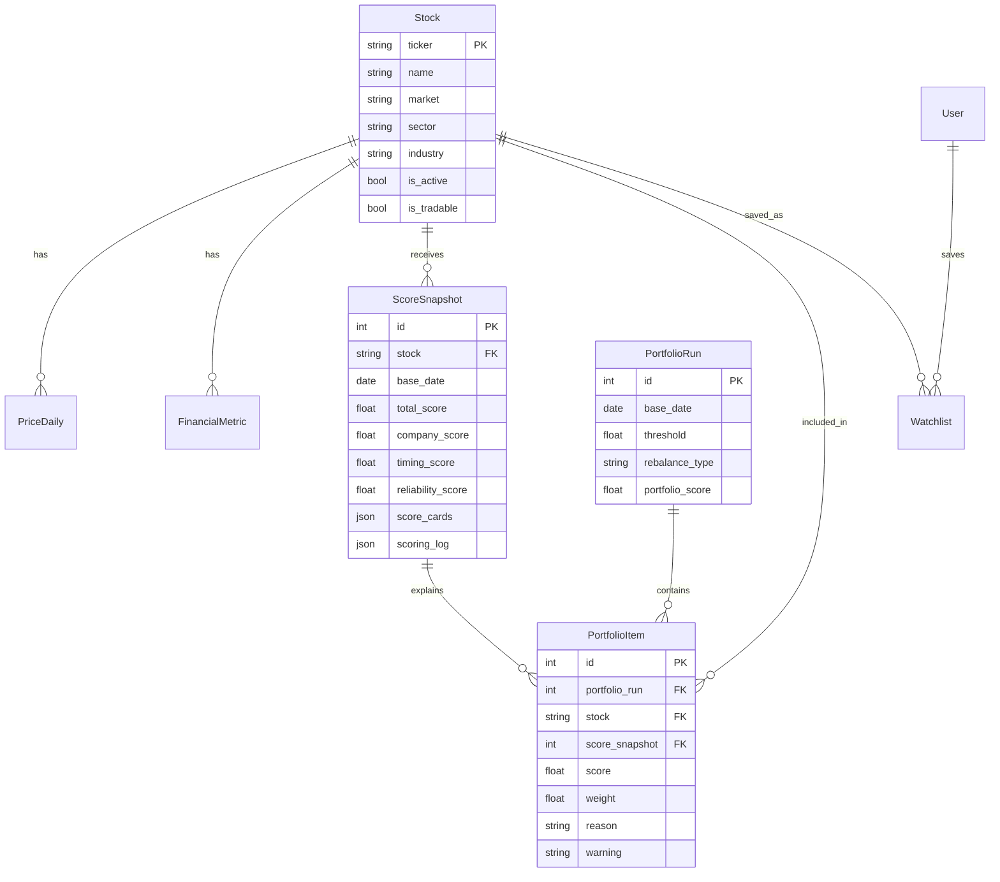
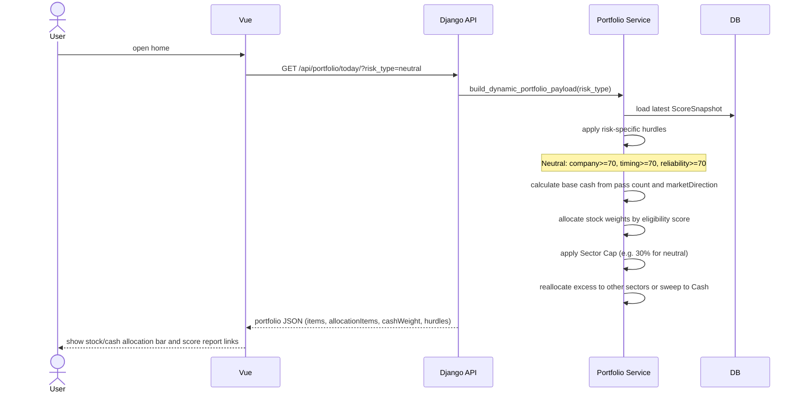
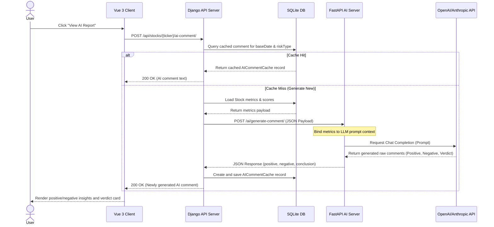
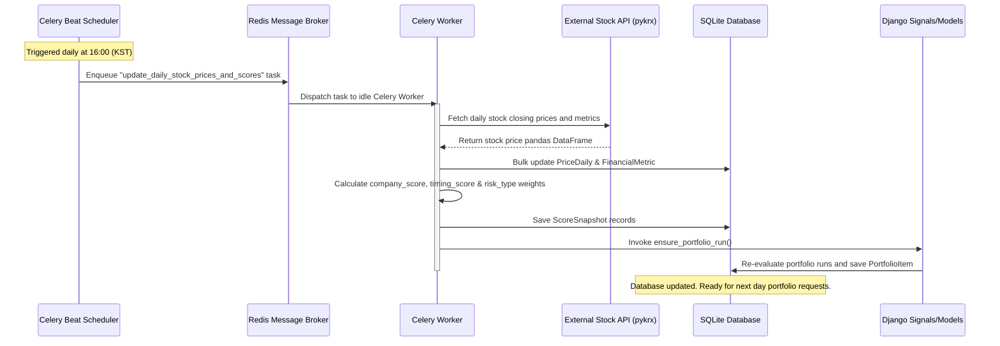

# UML Diagrams

## Use Case

```mermaid
flowchart TD
  User["User"] --> Home["View today's alpha portfolio"]
  Home --> Items["Check 70+ recommended stocks and score-above-threshold weights"]
  Items --> Report["Open stock score report"]
  Report --> Analysis["Review chart, score cards, indicators, news"]
  User --> Search["Search/filter all stocks"]
  User --> Backtest["View portfolio vs KOSPI backtest"]
  User --> Watchlist["Save/remove watchlist item"]
```

## ERD

```mermaid
erDiagram
  Stock ||--o{ PriceDaily : has
  Stock ||--o{ FinancialMetric : has
  Stock ||--o{ ScoreSnapshot : receives
  PortfolioRun ||--o{ PortfolioItem : contains
  Stock ||--o{ PortfolioItem : included_in
  ScoreSnapshot ||--o{ PortfolioItem : explains
  User ||--o{ Watchlist : saves
  Stock ||--o{ Watchlist : saved_as

  Stock {
    string ticker PK
    string name
    string market
    string sector
    string industry
    bool is_active
    bool is_tradable
  }

  ScoreSnapshot {
    int id PK
    string stock FK
    date base_date
    float total_score
    float company_score
    float timing_score
    float reliability_score
    json score_cards
    json scoring_log
  }

  PortfolioRun {
    int id PK
    date base_date
    float threshold
    string rebalance_type
    float portfolio_score
  }

  PortfolioItem {
    int id PK
    int portfolio_run FK
    string stock FK
    int score_snapshot FK
    float score
    float weight
    string reason
    string warning
  }
```

## Sequence: Today Portfolio

```mermaid
sequenceDiagram
  actor User
  participant Vue
  participant API as Django API
  participant Engine as Portfolio Service
  participant DB

  User->>Vue: open home
  Vue->>API: GET /api/portfolio/today/?risk_type=neutral
  API->>Engine: build_dynamic_portfolio_payload(risk_type)
  Engine->>DB: load latest ScoreSnapshot
  Engine->>Engine: apply risk-specific hurdles
  Note over Engine: Neutral: company>=70, timing>=70, reliability>=70
  Engine->>Engine: calculate base cash from pass count and marketDirection
  Engine->>Engine: allocate stock weights by eligibility score
  Engine->>Engine: apply Sector Cap (e.g. 30% for neutral)
  Engine->>Engine: reallocate excess to other sectors or sweep to Cash
  API-->>Vue: portfolio JSON (items, allocationItems, cashWeight, hurdles)
  Vue-->>User: show stock/cash allocation bar and score report links
```

## Sequence: FastAPI AI Comment Cache (Non-blocking AI Agent)

```mermaid
sequenceDiagram
  actor User
  participant Vue as Vue 3 Client
  participant Django as Django API Server
  participant DB as SQLite DB
  participant FastAPI as FastAPI AI Server
  participant LLM as OpenAI/Anthropic API

  User->>Vue: Click "View AI Report"
  Vue->>Django: POST /api/stocks/{ticker}/ai-comment/
  Django->>DB: Query cached comment for baseDate & riskType
  alt Cache Hit
    DB-->>Django: Return cached AICommentCache record
    Django-->>Vue: 200 OK (AI comment text)
  else Cache Miss (Generate New)
    Django->>DB: Load Stock metrics & scores
    DB-->>Django: Return metrics payload
    Django->>FastAPI: POST /ai/generate-comment/ (JSON Payload)
    Note over FastAPI: Bind metrics to LLM prompt context
    FastAPI->>LLM: Request Chat Completion (Prompt)
    LLM-->>FastAPI: Return generated raw comments (Positive, Negative, Verdict)
    FastAPI-->>Django: JSON Response (positive, negative, conclusion)
    Django->>DB: Create and save AICommentCache record
    Django-->>Vue: 200 OK (Newly generated AI comment)
  end
  Vue-->>User: Render positive/negative insights and verdict card
```

## Sequence: Async Batch Cron Rebalancing (Celery + Redis)

```mermaid
sequenceDiagram
  participant Beat as Celery Beat Scheduler
  participant Broker as Redis Message Broker
  participant Worker as Celery Worker
  participant Pykrx as External Stock API (pykrx)
  participant DB as SQLite Database
  participant Django as Django Signals/Models

  Note over Beat: Triggered daily at 16:00 (KST)
  Beat->>Broker: Enqueue "update_daily_stock_prices_and_scores" task
  Broker->>Worker: Dispatch task to idle Celery Worker
  activate Worker
  Worker->>Pykrx: Fetch daily stock closing prices and metrics
  Pykrx-->>Worker: Return stock price pandas DataFrame
  Worker->>DB: Bulk update PriceDaily & FinancialMetric
  Worker->>Worker: Calculate company_score, timing_score & risk_type weights
  Worker->>DB: Save ScoreSnapshot records
  Worker->>Django: Invoke ensure_portfolio_run()
  Django->>DB: Re-evaluate portfolio runs and save PortfolioItem
  deactivate Worker
  Note over DB: Database updated. Ready for next day portfolio requests.
```

