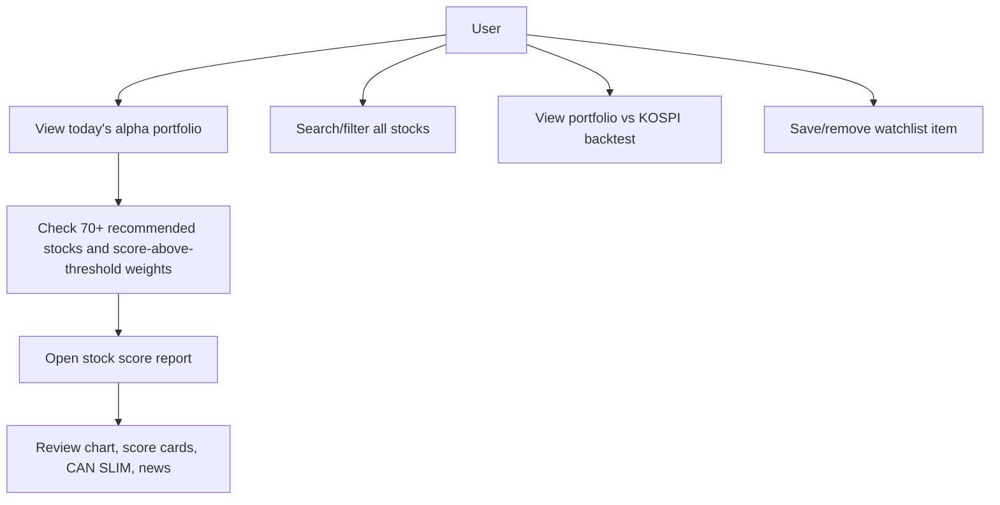
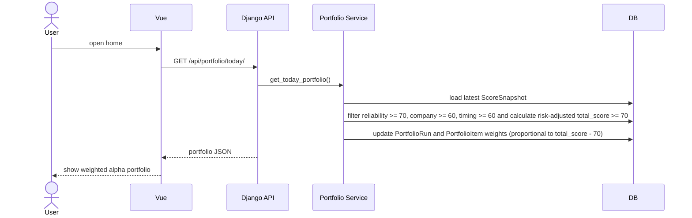

# UML Diagrams

## Use Case

```mermaid
flowchart TD
  User["User"] --> Home["View today's alpha portfolio"]
  Home --> Items["Check 70+ recommended stocks and score-above-threshold weights"]
  Items --> Report["Open stock score report"]
  Report --> Analysis["Review chart, score cards, CAN SLIM, news"]
  User --> Search["Search/filter all stocks"]
  User --> Backtest["View portfolio vs KOSPI backtest"]
  User --> Watchlist["Save/remove watchlist item"]
```

## ERD

```mermaid
erDiagram
  Stock ||--o{ PriceDaily : has
  Stock ||--o{ FinancialMetric : has
  Stock ||--o{ ScoreSnapshot : receives
  PortfolioRun ||--o{ PortfolioItem : contains
  Stock ||--o{ PortfolioItem : included_in
  ScoreSnapshot ||--o{ PortfolioItem : explains
  User ||--o{ Watchlist : saves
  Stock ||--o{ Watchlist : saved_as

  Stock {
    string ticker PK
    string name
    string market
    string sector
    string industry
    bool is_active
    bool is_tradable
  }

  ScoreSnapshot {
    int id PK
    string stock FK
    date base_date
    float total_score
    float company_score
    float timing_score
    float reliability_score
    json score_cards
    json can_slim
  }

  PortfolioRun {
    int id PK
    date base_date
    float threshold
    string rebalance_type
    float portfolio_score
  }

  PortfolioItem {
    int id PK
    int portfolio_run FK
    string stock FK
    int score_snapshot FK
    float score
    float weight
    string reason
    string warning
  }
```

## Sequence: Today Portfolio

```mermaid
sequenceDiagram
  actor User
  participant Vue
  participant API as Django API
  participant Engine as Portfolio Service
  participant DB

  User->>Vue: open home
  Vue->>API: GET /api/portfolio/today/
  API->>Engine: get_today_portfolio()
  Engine->>DB: load latest ScoreSnapshot
  Engine->>DB: filter reliability >= 70, company >= 60, timing >= 60 and calculate risk-adjusted total_score >= 70
  Engine->>DB: update PortfolioRun and PortfolioItem weights (proportional to total_score - 70)
  API-->>Vue: portfolio JSON
  Vue-->>User: show weighted alpha portfolio
```
