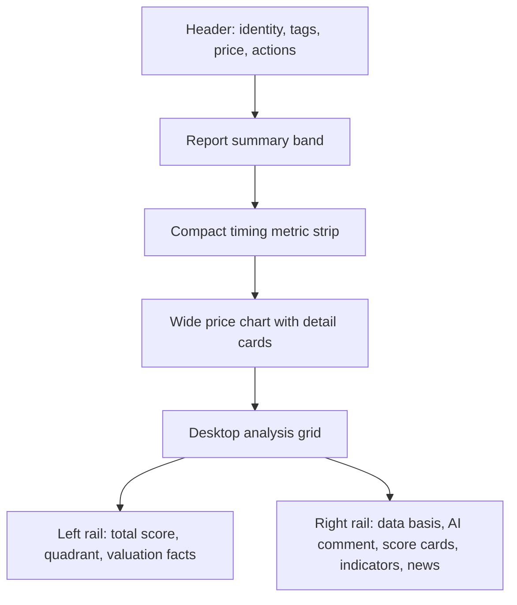

# Stock Report Page Redesign Plan

## Summary

This plan redesigns the stock report detail page so the first viewport reads like a polished investment report rather than a stack of independent panels. The work keeps the current data contract and focuses on layout, visual hierarchy, score presentation, chart context, and section consistency.

---

## Problem Frame

The current page exposes useful information, but the hero banner, timing cards, chart, side score rail, calculation blocks, score cards, indicators, and news area compete for attention. The screenshot shows a page that feels long, dense, and uneven: some cards are oversized, some headings are louder than their content, and the score treatment differs across sections.

---

## Requirements

**Top Summary**

- R1. The page must make the stock name, price, daily change, sector, themes, and major action buttons clear in the first viewport.
- R2. The headline summary must look like an AlphaPick report module, not a heavy bordered alert box.
- R3. The timing cards must support quick scanning without adding excess vertical height.

**Chart And Score**

- R4. The price chart must remain readable with labels, legends, volume bars, moving averages, and the existing chart detail cards.
- R5. Score presentation must use the current AlphaPick score language: mint for 70+, amber for 50-69, and rose for below 50.
- R6. The company-value versus timing quadrant must stay available, but it should not dominate the left rail.

**Lower Report Sections**

- R7. Data basis, AI comment, score cards, technical indicators, financial indicators, and news must share one consistent section style.
- R8. Repeated nested card borders should be reduced so the page feels lighter and closer to the main dashboard design.
- R9. Mobile and desktop layouts must avoid clipped text, horizontal overflow, and chart overlap.

---

## Key Technical Decisions

- KTD1. Keep the redesign inside `frontend/src/views/StockReportView.vue`: the current page is implemented as a single view with local helper functions and an inline `IndicatorSection`, so a scoped redesign avoids unnecessary component churn.
- KTD2. Preserve the API shape from `/api/stocks/:ticker/report/`: this is a visual redesign, not a backend data change.
- KTD3. Use the existing `.panel`, `.badge`, button classes, SUIT font, and Tailwind utility style: this keeps the report aligned with the dashboard, portfolio, and stock search pages.
- KTD4. Promote a two-column desktop report rhythm only after the chart: the header and chart should span wide, while deeper analysis can use a compact left summary and right content column.
- KTD5. Defer new interactions such as sticky tabs or collapsible sections: the current request is visual cleanup, and adding navigation behavior would widen the risk surface.

---

## High-Level Technical Design

---

## Implementation Units

### U1. Header And Summary Redesign

- **Goal:** Replace the heavy slate headline box with a cleaner report summary band and tighten the stock identity area.
- **Files:** `frontend/src/views/StockReportView.vue`
- **Patterns:** Follow the lighter page rhythm used by `frontend/src/views/HomeView.vue` and `frontend/src/views/PortfolioView.vue`.
- **Test Scenarios:** Verify that long stock names, multiple theme badges, volume surge badges, and both positive and negative daily changes wrap without covering the action buttons.
- **Verification:** Run `npm run build` from `frontend`.

### U2. Compact Timing Cards And Chart Section

- **Goal:** Make the timing cards and chart feel like one analysis block with consistent spacing, less border weight, and clear labels.
- **Files:** `frontend/src/views/StockReportView.vue`
- **Patterns:** Keep the existing SVG chart helper functions and chart detail cards; change layout classes and visual treatment only.
- **Test Scenarios:** Verify that chart axes, date labels, legends, volume bars, and four detail cards remain visible for `067310.KQ` and `005930.KS`.
- **Verification:** Run `npm run build` and visually check `/stocks/067310.KQ`.

### U3. Score Rail Refinement

- **Goal:** Keep final score, verdict, quadrant, and valuation facts useful while reducing the left rail's visual weight.
- **Files:** `frontend/src/views/StockReportView.vue`
- **Patterns:** Reuse score color helpers already present in the view and match the score-line style used by `frontend/src/views/PortfolioView.vue`.
- **Test Scenarios:** Verify total scores above 70, between 50 and 69, and below 50 render distinct colors and do not conflict with quadrant colors.
- **Verification:** Use available report data and build validation.

### U4. Lower Section Style Unification

- **Goal:** Apply one consistent section header, card surface, row spacing, and text hierarchy to data basis, AI comment, score cards, indicators, and news.
- **Files:** `frontend/src/views/StockReportView.vue`
- **Patterns:** Keep the inline `IndicatorSection` API intact while updating its rendered classes to match the redesigned section style.
- **Test Scenarios:** Verify empty AI comment, loaded AI comment, missing financial metrics, and news with positive, neutral, and negative sentiment all render cleanly.
- **Verification:** Run `npm run build`; manually check the report page after loading a stock with sparse financial data.

### U5. Responsive And Regression Pass

- **Goal:** Ensure the redesigned page works on desktop and narrower widths without horizontal scroll or text collision.
- **Files:** `frontend/src/views/StockReportView.vue`
- **Patterns:** Prefer grid breakpoints, `min-w-0`, wrapping badges, and bounded chart heights already used elsewhere in the app.
- **Test Scenarios:** Verify desktop, tablet-width, and mobile-width layouts for header actions, chart, score rail, and lower sections.
- **Verification:** Run `npm run build`; if the dev server is running, inspect `/stocks/067310.KQ` and `/stocks/005930.KS`.

---

## Scope Boundaries

- This plan does not change backend scoring, PyKRX refresh logic, database fields, or API serializers.
- This plan does not add a new charting library; the existing SVG chart remains in place.
- This plan does not introduce tabs, sticky navigation, or collapsible sections unless the implementation reveals that layout alone cannot solve the density problem.
- This plan does not update documentation unless the visible behavior changes enough to require README or docs screenshots later.

---

## Risks And Dependencies

- The view is large and template-heavy, so small class changes can affect distant responsive behavior.
- The inline SVG chart uses fixed viewBox geometry; visual changes around it should preserve the existing coordinate helpers.
- Some report data can be missing or sparse, so redesign work must keep fallback text and empty states visible.
- The current app uses utility classes heavily; adding custom CSS should be limited to cases where utilities make the template harder to scan.

---

## Acceptance Examples

- AE1. Given a stock report with multiple themes and a volume surge badge, when the page loads on desktop, then the header shows identity, price, change, badges, and actions without overlap.
- AE2. Given `067310.KQ`, when the chart section renders, then the chart labels, legend, detail cards, and core observation are all visible within the panel.
- AE3. Given a stock with missing PER or ROE, when the valuation facts and financial indicators render, then the page shows fallback text without breaking row alignment.
- AE4. Given a narrow viewport, when the report page is viewed, then no horizontal scroll is introduced by the chart, badges, score cards, or indicator rows.

---

## Sources

- `frontend/src/views/StockReportView.vue` contains the report page template, chart SVG, score rail, AI comment block, score cards, inline indicator section, and data helpers.
- `frontend/src/views/HomeView.vue` provides the lighter dashboard table and score-line style to align with.
- `frontend/src/views/PortfolioView.vue` provides the current portfolio score color and progress-line treatment.
- `frontend/src/assets/styles.css` defines shared `.panel` and `.badge` primitives used across the app.
